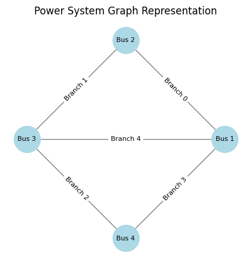

# Lesson 1: Buses and branches

A power system can be represented as a **graph**, where:
- **Nodes (Buses)** represent points in the network where the voltage is computed, and where elements are connected.
- **Edges (Branches)** represent transmission lines, cables, or transformers that connect these nodes.

Graph theory provides a mathematical framework to analyze power networks efficiently.

### Bus (Node)
A **bus** (also called a **node** in graph theory) is a
point where electrical components are connected.
Each node has associated properties such as the nominal voltage.

#### Example Bus Data
| Bus Index | Bus Name  | Voltage Level (kV) |
|-----------|----------|-------------------|
| 0         | Bus 1    | 230               |
| 1         | Bus 2    | 230               |
| 2         | Bus 3    | 115               |
| 3         | Bus 4    | 115               |


```python
class Bus:
    def __init__(self, name: str, voltage_level: float):
        self.name = name
        self.voltage_level = voltage_level

# Create instances of buses
buses = [
    Bus("Bus 1", 230.0),
    Bus("Bus 2", 230.0),
    Bus("Bus 3", 115.0),
    Bus("Bus 4", 115.0)
]
```

### Branches (Edges)
A **branch** (or **edge** in graph theory) is a connection between two nodes.
In power systems, branches correspond to transmission lines
or transformers that carry electrical power between nodes.

#### Example Branch Data
| Branch Index | From Bus | To Bus | Impedance (p.u.) |
|-------------|---------|--------|-----------------|
| 0           | 0       | 1      | 0.02 + j0.05    |
| 1           | 1       | 2      | 0.03 + j0.08    |
| 2           | 2       | 3      | 0.025 + j0.07   |
| 3           | 3       | 0      | 0.04 + j0.09    |
| 4           | 0       | 2      | 0.01 + j0.03    |


```python
class Branch:
    def __init__(self, name: str, from_bus: int, to_bus: int, impedance: complex):
        self.name = name
        self.from_bus = from_bus
        self.to_bus = to_bus
        self.impedance = impedance

# Create instances of branches
branches = [
    Branch("Branch 0", 0, 1, 0.02 + 0.05j),
    Branch("Branch 1", 1, 2, 0.03 + 0.08j),
    Branch("Branch 2", 2, 3, 0.025 + 0.0j),
    Branch("Branch 3", 3, 0, 0.04 + 0.09j),
    Branch("Branch 4", 0, 2, 0.01 + 0.03j)
]
```

### Graph Representation

Once we have defined the Bus and Branch elements and created some example instances, we can proceed to plot them.
For that we are going to use the networkx library. This library not only allows us to plot, but provides some very useful functions. However for the purpose of understanding the fundamentals and later efficiency, we are not going to use networkx's functions and structures but develop our own.

The python code to diaply the example is:


```python
import networkx as nx
import matplotlib.pyplot as plt

# Create a graph
G = nx.Graph()

# Add nodes (representing buses)
nodes = {i: bus.name for i, bus in enumerate(buses)}
G.add_nodes_from(nodes.keys())

# Add edges (representing transmission lines or transformers)
edges = {(branch.from_bus, branch.to_bus): branch.name for branch in branches}
G.add_edges_from(edges)

# Position nodes using Kamada-Kawai layout
pos = nx.kamada_kawai_layout(G)

# Draw the network
plt.figure(figsize=(4, 4))
nx.draw(G, pos, with_labels=True, labels=nodes, node_color='lightblue', edge_color='gray', node_size=1000, font_size=8)

# draw edge labels
nx.draw_networkx_edge_labels(G, pos, edge_labels=edges, font_size=8)

plt.title("Power System Graph Representation")
plt.show()
```


    

    


### Connectivity  Matrices

We have used the networkx library to represent the grid.
However, that is not a very efficient representation. For later usages we better use
**connectivity matrices**. These are matrices that indicate the connection between a branch and it's "from" or "to" bus.
To form those matrices we enter a `1` at the position of the bus of the corresponding branch.
For further simplificy, and later convenience, we create a "from" connectivity matrix `Cf` and a "to" connectivity matrix `Ct`.

The connectivity matrices allow us to convert branch magnitudes to nodal, and vice-versa. They are quite useful in power systems.


```python
import numpy as np
import pandas as pd

n = len(buses)
m = len(branches)

# Initialize connectivity matrices "from" and "to"
Cf = np.zeros((m, n), dtype=int)
Ct = np.zeros((m, n), dtype=int)

# Fill connectivity matrices
for k, branch in enumerate(branches):
    Cf[k, branch.from_bus] = 1
    Ct[k, branch.to_bus] = 1

# display the matrices nicely
bus_names = [bus.name for bus in buses]
branch_names = [branch.name for branch in branches]
print("Cf Matrix:")
print(pd.DataFrame(data=Cf, index=branch_names, columns=bus_names))

print()
print("Ct Matrix:")
print(pd.DataFrame(data=Ct, index=branch_names, columns=bus_names))
```

    Cf Matrix:
              Bus 1  Bus 2  Bus 3  Bus 4
    Branch 0      1      0      0      0
    Branch 1      0      1      0      0
    Branch 2      0      0      1      0
    Branch 3      0      0      0      1
    Branch 4      1      0      0      0
    
    Ct Matrix:
              Bus 1  Bus 2  Bus 3  Bus 4
    Branch 0      0      1      0      0
    Branch 1      0      0      1      0
    Branch 2      0      0      0      1
    Branch 3      1      0      0      0
    Branch 4      0      0      1      0


### Adjcency matrix (A)
In contrast with the connectivity matrices, the adjacency matrix indices which bus is connected to which other bus.
This matrix is rarely used to create other matrices such as the Admittance matrix, but it is the center of topology processing.
To generate `A` we can do it by using the already computed connectivity matrices `Cf`and `Ct` or by direct compsition:


```python
# Compose the total connectivity matrix:
C = Cf + Ct

# Compose A
A = C.T @ C

print("Adjacency Matrix:")
print(pd.DataFrame(data=A, index=bus_names, columns=bus_names))
```

    Adjacency Matrix:
           Bus 1  Bus 2  Bus 3  Bus 4
    Bus 1      3      1      1      1
    Bus 2      1      2      1      0
    Bus 3      1      1      3      1
    Bus 4      1      0      1      2


Observe that the computed adjacency matrix has elements that are not 1. Those numbers indicate the number of neighbours of the bus we are looking at.
The fact that those numbers are not 1, could be severely problematic if we were to use `A` for some operation as we would intent with `Cf`or `Ct`. From `A` we only care about the position of the non-zero entries. This will gain relevance in topology processing.

Now, we could also compose A by inspection of the branches:


```python
A = np.zeros((n, n), dtype=int)

for k, branch in enumerate(branches):
    A[branch.from_bus, branch.from_bus] += 1
    A[branch.from_bus, branch.to_bus] += 1
    A[branch.to_bus, branch.from_bus] += 1
    A[branch.to_bus, branch.to_bus] += 1

print("Adjacency Matrix:")
print(pd.DataFrame(data=A, index=bus_names, columns=bus_names))
```

    Adjacency Matrix:
           Bus 1  Bus 2  Bus 3  Bus 4
    Bus 1      3      1      1      1
    Bus 2      1      2      1      0
    Bus 3      1      1      3      1
    Bus 4      1      0      1      2


This second way of computing `A` involves no matrix multiplication or trasposition and seems simpler.
However, we will observe that it will be slower when using sparse matrices.
In this lesson we have used dense arrays for simplicity, but it will be the last time we do it.
