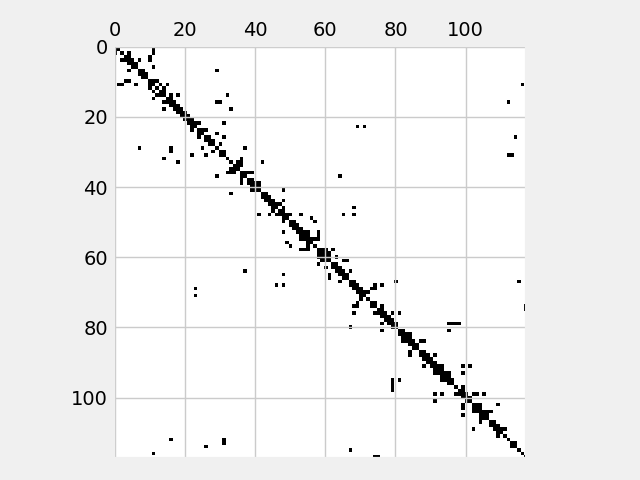

## Lesson 2: Sparse Matrices in Power Systems



In power system analysis, many matrices such as the **admittance matrix (Y-matrix)** and
**connectivity matrices** are **sparse**—meaning they contain mostly zeros.
Storing and processing such matrices efficiently is crucial for large-scale power grids.

Sparse matrices are commonly represented in compressed formats to save memory and improve computational performance.
Four widely used formats are:
- **COO (Coordinate Format)**
- **LIL (List of Lists Format)**
- **CSC (Compressed Sparse Column Format)**
- **CSR (Compressed Sparse Row Format)**

We will explore these formats and their application to power system matrices.


### Coordinate Format (COO)
The **COO format** (Coordinate List) is one of the simplest sparse matrix formats. It is well suited for constructing matrices dynamically but inefficient for modifications and arithmetic operations. It stores a sparse matrix using three separate lists:
1. **Row indices** – Specifies the row positions of nonzero elements.
2. **Column indices** – Specifies the column positions of nonzero elements.
3. **Values** – Contains the actual nonzero values.


```python
import numpy as np
from scipy.sparse import coo_matrix

# Define matrix in COO format
row = np.array([0, 1, 2, 2, 3])  # Row indices
col = np.array([1, 2, 3, 0, 1])  # Column indices
data = np.array([10, 20, 30, 40, 50])  # Nonzero values

# Create COO sparse matrix
coo = coo_matrix((data, (row, col)), shape=(4, 4))

print("COO Format Sparse Matrix:")
print(coo)

# Print internals
print("Internals:")
print("Row indices:", coo.row)
print("Column indices:", coo.col)
print("Data:", coo.data)
```

    COO Format Sparse Matrix:
    <COOrdinate sparse matrix of dtype 'int64'
    	with 5 stored elements and shape (4, 4)>
      Coords	Values
      (0, 1)	10
      (1, 2)	20
      (2, 3)	30
      (2, 0)	40
      (3, 1)	50
    Internals:
    Row indices: [0 1 2 2 3]
    Column indices: [1 2 3 0 1]
    Data: [10 20 30 40 50]


### List of Lists (LIL) Format
The **LIL format** is ideal for constructing sparse matrices that require frequent modifications, as it stores the matrix as a list of lists where each row contains column indices and values.


```python
from scipy.sparse import lil_matrix

# Create LIL sparse matrix
lil = lil_matrix((4, 4))
lil[0, 1] = 10
lil[1, 2] = 20
lil[2, 3] = 30
lil[2, 0] = 40
lil[3, 1] = 50

print("LIL Format Sparse Matrix:")
print(lil)

# Print internals
print("Internals:")
print("LIL matrix row data:", lil.rows)
print("LIL matrix data:", lil.data)
```

    LIL Format Sparse Matrix:
    <List of Lists sparse matrix of dtype 'float64'
    	with 5 stored elements and shape (4, 4)>
      Coords	Values
      (0, 1)	10.0
      (1, 2)	20.0
      (2, 0)	40.0
      (2, 3)	30.0
      (3, 1)	50.0
    Internals:
    LIL matrix row data: [list([1]) list([2]) list([0, 3]) list([1])]
    LIL matrix data: [list([np.float64(10.0)]) list([np.float64(20.0)])
     list([np.float64(40.0), np.float64(30.0)]) list([np.float64(50.0)])]


### Compressed Sparse Column (CSC) Format
The **CSC format** is widely used for fast column-based operations, such as **LU factorization** and **matrix-vector multiplication**. It consists of:
1. **Data array** – Stores nonzero elements.
2. **Row indices** – Stores row indices of nonzero elements.
3. **Column pointers** – Indicates where each column starts in the data array.


```python
from scipy.sparse import csc_matrix

# Convert COO to CSC
csc = coo.tocsc()

print("CSC Format Sparse Matrix:")
print(csc)

# Print internals
print("Internals:")
print("Data:", csc.data)
print("Row indices:", csc.indices)
print("Column pointers:", csc.indptr)
```

    CSC Format Sparse Matrix:
    <Compressed Sparse Column sparse matrix of dtype 'int64'
    	with 5 stored elements and shape (4, 4)>
      Coords	Values
      (2, 0)	40
      (0, 1)	10
      (3, 1)	50
      (1, 2)	20
      (2, 3)	30
    Internals:
    Data: [40 10 50 20 30]
    Row indices: [2 0 3 1 2]
    Column pointers: [0 1 3 4 5]


### Compressed Sparse Row (CSR) Format
The **CSR format** is optimized for fast row-based operations, such as **Gaussian elimination**, and is widely used in numerical solvers.


```python
from scipy.sparse import csr_matrix

# Convert COO to CSR
csr = coo.tocsr()

print("CSR Format Sparse Matrix:")
print(csr)

# Print internals
print("Internals:")
print("Data:", csr.data)
print("Column indices:", csr.indices)
print("Row pointers:", csr.indptr)
```

    CSR Format Sparse Matrix:
    <Compressed Sparse Row sparse matrix of dtype 'int64'
    	with 5 stored elements and shape (4, 4)>
      Coords	Values
      (0, 1)	10
      (1, 2)	20
      (2, 0)	40
      (2, 3)	30
      (3, 1)	50
    Internals:
    Data: [10 20 40 30 50]
    Column indices: [1 2 0 3 1]
    Row pointers: [0 1 2 4 5]


### Comparing Sparse Formats

If we think about it, there is not single format that is efficient for creation, reading, updating or deletion.
Each format excels at some points and lags in others. The following table analyzes some of this:


| Feature  | COO Format | CSC Format | LIL Format | CSR Format |
|----------|-----------|------------|------------|------------|
| Storage  | Triplet format (row, col, value) | Column-wise compressed storage | Row-based list storage | Row-wise compressed storage |
| Efficiency | Good for constructing matrices | Good for fast column-based operations (LU factorization) | Best for incremental modifications | Best for fast row-based operations (Gaussian elimination) |
| Modification | Slow | Not efficient | Very efficient | Not efficient |
| Traversing | Slow | Fast for columns | Fast for rows | Fast for rows |
| Application | Initial matrix setup | Sparse linear solvers, LU factorization | Dynamic sparsity pattern modifications | Direct solvers, iterative methods |

By using sparse matrix formats like COO, CSC, LIL, and CSR, we can handle large power grids more efficiently, saving memory and computation time.
Depending on the design of the power system simulator, one could just use COO and CSC matrices, or perhaps LIL and CSC matrices.

### Example

Now let's redo an example from the lesson 1 in sparse mode.
We will use different types of sparse matrices for different porpuses attending to their structural efficiency.
First we enter the example data:


```python
class Bus:
    def __init__(self, name: str, voltage_level: float):
        self.name = name
        self.voltage_level = voltage_level

# Create instances of buses
buses = [
    Bus("Bus 1", 230.0),
    Bus("Bus 2", 230.0),
    Bus("Bus 3", 115.0),
    Bus("Bus 4", 115.0)
]

class Branch:
    def __init__(self, name: str, from_bus: int, to_bus: int, impedance: complex):
        self.name = name
        self.from_bus = from_bus
        self.to_bus = to_bus
        self.impedance = impedance

# Create instances of branches
branches = [
    Branch("Branch 0", 0, 1, 0.02 + 0.05j),
    Branch("Branch 1", 1, 2, 0.03 + 0.08j),
    Branch("Branch 2", 2, 3, 0.025 + 0.0j),
    Branch("Branch 3", 3, 0, 0.04 + 0.09j),
    Branch("Branch 4", 0, 2, 0.01 + 0.03j)
]
bus_names = [bus.name for bus in buses]
branch_names = [branch.name for branch in branches]

```

#### Computing the connectivity matrices

Notice that the connectivity matrix creation is an "insert only" operation. For each position fo `Cf`or `Ct` we just assign a 1 and not care if there was any other value there before.
Hence, the COO format is grat for that pupose.


```python
import numpy as np
import pandas as pd
from scipy.sparse import coo_matrix

n = len(buses)
m = len(branches)

# Define matrix in COO format
row = np.array([0, 1, 2, 2, 3])  # Row indices
col = np.array([1, 2, 3, 0, 1])  # Column indices
data = np.array([10, 20, 30, 40, 50])  # Nonzero values

# Fill connectivity matrices
for k, branch in enumerate(branches):
    row[k] = k
    col[k] = branch.from_bus
    data[k] = 1

# Create COO sparse matrix
Cf = coo_matrix((data, (row, col)), shape=(m, n))

print("COO Format Sparse Matrix:")
print(Cf)
print("\nInternals:")
print(pd.DataFrame(data=np.c_[Cf.row, Cf.col, Cf.data],
                   columns=["row", "col", "data"],
                   index=branch_names))

print("\nWhich in dense format is again:")
print(pd.DataFrame(data=Cf.toarray(), index=branch_names, columns=bus_names))
```

    COO Format Sparse Matrix:
    <COOrdinate sparse matrix of dtype 'int64'
    	with 5 stored elements and shape (5, 4)>
      Coords	Values
      (0, 0)	1
      (1, 1)	1
      (2, 2)	1
      (3, 3)	1
      (4, 0)	1
    
    Internals:
              row  col  data
    Branch 0    0    0     1
    Branch 1    1    1     1
    Branch 2    2    2     1
    Branch 3    3    3     1
    Branch 4    4    0     1
    
    Which in dense format is again:
              Bus 1  Bus 2  Bus 3  Bus 4
    Branch 0      1      0      0      0
    Branch 1      0      1      0      0
    Branch 2      0      0      1      0
    Branch 3      0      0      0      1
    Branch 4      1      0      0      0


Once we finalize the construction of our beloved `Cf`matrix usng efficient COO insertion, we better store it in CSC format for later use in efficient algotithms, since we do not need to modify it again.


```python
Cf = Cf.tocsc()

print("Internals:")
print("Data:", Cf.data)
print("Row indices:", Cf.indices)
print("Column pointers:", Cf.indptr)
```

    Internals:
    Data: [1 1 1 1 1]
    Row indices: [0 4 1 2 3]
    Column pointers: [0 2 3 4 5]

