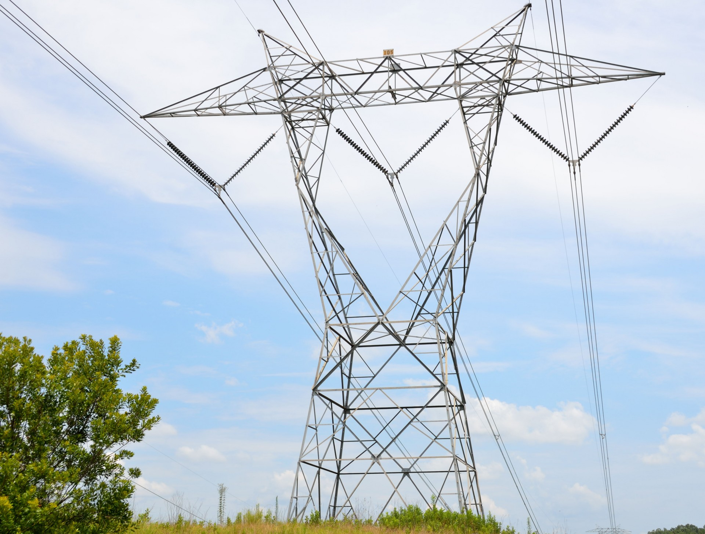
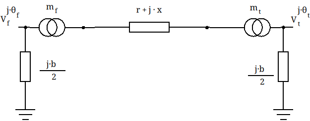

# The line



Power lines are fundamental components of power systems, responsible for transmitting electrical energy from generation sources to loads. They can be represented using mathematical models that describe their electrical behavior. In this notebook, we will discuss:
- The **$\pi$-model** for transmission lines
- The **three-phase system**
- **Sequence components** equivalent.

## The $\pi$ equivalent

The $\pi$-model is a widely used equivalent circuit representation of transmission lines. It consists of:
- **Series impedance**: $Z = R + jX$
- **Shunt admittance**: $Y = jB$

#### The $\pi$-model Circuit Representation:



- R: Series resistance
- X: Series reactance
- B: Shunt susceptance (derived from the line capacitance)
- $m_f$: Virtual tap at the from side $m_f = Vnom_{line} / Vnom_{bus\_from}$
- $m_t$: Virtual tap at the from side $m_t = Vnom_{line} / Vnom_{bus\_to}$

The name $\pi$ comes from the portal like shape of the model, where the line capacitance, that normally happens uniformilly distributed thoughout the line is lumped at the connection points of the line. There are other approximations to modelling, but the $\pi$ model is almos universally recognized for mid-length lines.

The virtual taps $m_f$ and $m_t$ are almost never discussed, but they are essential for the accurate per unit representation, as they only emerge in per unit calculations. They are meant to account for the impedance modification that is necessary to match the line voltage and the bus voltage in per-unit representations. In lines, these are used when a line connects two buses with slightly different nominal voltage (up to 5% difference)


## Three-phase representation

In the real world, a power line used for altern-current (AC) will operate with the three-phase system invented by Nikola Tesla. This system, is able to transport three times power power than the DC equivalent with half the wires (3 for AC, 3x2 for DC). When modelling however, we need to consider a 5-wire approach, that later becomes a 3-wire equivalent.

### 5-wire model:
The 5-wire model is that including the three phases + neutral + ground.

- Three-Phase Conductors: The first three wires are the three phase conductors (often labeled as A, B, and C). These carry the alternating current (AC) electricity and are used to distribute power efficiently.

- Neutral Wire: The fourth wire is the neutral conductor. It provides a return path for current and helps balance the load across the phases. The neutral wire is essential for safety and is used in single-phase connections as well.

- Ground Wire: The fifth wire is typically a ground wire, which is crucial for safety. It helps protect against electrical faults by providing a path for excess current to safely dissipate into the earth, preventing electrical shock and equipment damage.

All AC power lines will have from one to three phases. Not all phisical lines will have neutral, and the "ground return" is certainly not a wire, but it is represented as one in order to close the electrical circuit.

```
        (power line)
A|---------(za)----------------|A
B|---------
            \
             \
               ---(zb)---------|B
C|-----------(zc)--------------|C
N|-----------(zn)--------------|N
G|______________(zg)___________|G
```

Each wire has its own impedance. However, other impedances arise from the electromagnetic coupling of the wires, such that we need to use
a 5 by 5 matrix to represent the total line impedance:

$$ Z_{ABCNG} = \begin{bmatrix}
Z_{AA} & Z_{AB} & Z_{AC} & Z_{AN} & Z_{AG} \\
Z_{BA} & Z_{BB} & Z_{BC} & Z_{BN} & Z_{BG} \\
Z_{CA} & Z_{CB} & Z_{CC} & Z_{CN} & Z_{CG} \\
Z_{NA} & Z_{NB} & Z_{NC} & Z_{CN} & Z_{NG} \\
Z_{GA} & Z_{GB} & Z_{GC} & Z_{GN} & Z_{GG} \end{bmatrix} $$

Most power lines do not carry the neutral, since that one is often formed by the substation transformer. Then, we can simply write:

$$ Z_{ABCG} = \begin{bmatrix}
Z_{AA} & Z_{AB} & Z_{AC} & Z_{AG} \\
Z_{BA} & Z_{BB} & Z_{BC} & Z_{BG} \\
Z_{CA} & Z_{CB} & Z_{CC} & Z_{CG} \\
Z_{GA} & Z_{GB} & Z_{GC} & Z_{GG} \end{bmatrix} $$

The way we come up with each of these matrix impedances is quite complex and depends on the line configuration, if it is overhead or underground, spacing and other parameters.

#### Carson series impedance

Carson's equations, introduced in 1926, are used in power system analysis to calculate the series self and mutual impedances of overhead transmission lines, taking into account the effects of the ground return path. They are based on the following assumptions:

- The conductors are perfectly horizontal above ground and are long enough so that three-dimensional end effects can be neglected. This makes the field problem two-dimensional. The sag is taken into account indirectly by using an average height above ground.
    
- The free space is homogeneous and lossless, with permeability $\mu_0$ and permittivity $\varepsilon_0$.

- The earth is homogeneous, with uniform resistivity $\rho$, permeability $\mu_0$, and permittivity $\varepsilon_0$, bounded by a flat plane of infinite extent.

- The spacing between conductors is at least one order of magnitude larger than the conductor radius, so that proximity effects can be ignored.


The elements of the series impedance matrix can then be calculated from the geometry of the tower configuration shown in the previous figure, and from the characteristics of conductors. Then, self and mutual impedances can be computed using the following equations:

$$
\vec{Z}_{ii} = (R_i+R^c_{ii}) + j \left(\omega \frac{\mu_0}{2\pi} \ln{\frac{2h_i}{r_i}} + X_i + X^c_{ii} \right)
$$

$$
\vec{Z}_{ij} = \vec{Z}_{ji} = R^c_{ij} + j \left( \omega \frac{\mu_0}{2\pi} \ln{\frac{D_{ij}}{d_{ij}}} + X^c_{ij} \right)
$$

Where:

- $R_i$ and $X_i$ are the internal resistance and reactance of conductor $i$ in $\Omega$/km.
- $R^c$ and $X^c$ are the Carson's correction terms for earth return effects in $\Omega$/km.
- $\mu_0 = 4\pi\cdot 10^{-4}$ H/km is the permeability of free space.
- $\omega = 2\pi f$ rad/s is the angular frequency.
- $h_i$ is the average height above ground of conductor $i$ in m.
- $r_i$ is the radius of conductor $i$ in m.
- $d_{ij}$ is the distance between conductors $i$ and $j$ in m.
- $D_{ij}$ is the distance between conductor $i$ and the image of conductor $j$ in m.

The correction terms $R^c$ and $X^c$ are derived from an infinite integral representing the impedance contribution due to the earth return path. This is expressed as:

$$
\vec{Z}^c_{ii} = 4 \omega \int_0^\infty \left( \sqrt{\mu^2 + j} - \mu \right) e^{-2 h_i \mu} \, d\mu
$$

$$
\vec{Z}^c_{ij} = 4 \omega \int_0^\infty \left( \sqrt{\mu^2 + j} - \mu \right) e^{-(h_i+h_j) \mu} \cos{x_{ij}\mu} \, d\mu
$$

Here, $a = 4\pi \lambda \omega$, with $\lambda = 1/\rho$ being the ground conductivity. This integral formulation was derived by Carson from Maxwell’s equations, considering a homogeneous semi-infinite earth medium, and forms the theoretical basis for the correction terms. Due to the complexity of the integrals, Carson introduced a rapidly converging asymptotic series to approximate it under engineering conditions. The correction terms are expressed as:

$$
R^c = \frac{\pi}{8} - b_0 a \cos(\theta) + \sum_{n=1}^{\infty} R^c_n
$$

$$
X^c = \frac{1}{2} \left( 0.6159315 - \ln{a} \right) + b_0 a \cos(\theta) + \sum_{n=1}^{\infty} X^c_n
$$

With:
$$
a = 4 \pi \sqrt{5} \cdot 10^{-5} \cdot D \sqrt{\frac{f}{\rho}}, \quad \theta = \cos^{-1} \left( \frac{h_i + h_j}{D} \right)
$$

The coefficients $b_n$, $c_n$ and $d_n$ in the series are defined recursively to ensure rapid convergence. The infinite series is evaluated iteratively until the correction factors converge within a specified error tolerance $\varepsilon$:

$$
\text{error} = \sqrt{(R^c_{n} - R^c_{n-1})^2 + (X^c_{n} - X^c_{n-1})^2} < \varepsilon
$$

In most practical cases, only the first few terms are required for accurate results. The computed $R^c$ and $X^c$ values are then used in the previous exposed equations.


```python
import numpy as np

def calc_L_int(type, r, q):
    """
    Calculates internal inductance of solid or tubular conductor
    Note that calculations assume uniform current distribution in the conductor, thus conductor stranding is not taken into account.

    Usage:
        L_int = calc_L_int(type, r, q)

    where:
       type is 'solid' or 'tube'
        r is the radius of the conductor [m]
        q is the radius of the inner tube [m]

    Returns:
        L_int the internal inductance of the conductor [H/m]
    """
    mu_0 = 4 * np.pi * 1e-7 # Permeability of free space [H/m]

    if type == 'solid':
        L_int = mu_0 / 8 / np.pi # Solid conductor internal inductance [H/m]
    else:
        L_int = mu_0 / 2 / np.pi * (q ** 4 / (r ** 2 - q ** 2) ** 2 * np.log(r / q) - (3 * q ** 2 - r ** 2) / (4 * (r ** 2 - q ** 2))) # Tubular conductor internal inductance [H/m]

    return L_int


def calc_GMR(type, r, q):
    """
    Calculates geometric mean radius (GMR) of solid or tubular conductor
    Note that calculations assume uniform current distribution in the conductor, thus conductor stranding is not taken into account.

    Usage:
        GMR = calc_GMR(type, r, q)

    where   type is 'solid' or 'tube'
            r is the radius of the conductor [m]
            q is the radius of the inner tube [m]

    Returns:
            GMR the geometric mean radius [m]
    """
    if type == 'solid':
        GMR = r * np.exp(-0.25) # Solid conductor GMR [m]
    else:
        GMR = r * np.exp((3 * q ** 2 - r ** 2) / (4 * (r ** 2 - q ** 2)) - q ** 4 / (r ** 2 - q ** 2) ** 2 * np.log(r / q)) # Tubular conductor GMR [m]

    return GMR


def carsons(type, h_i, h_k, x_ik, f, rho, err_tol=1e-6):
    """
    Calculates Carson's earth return correction factors Rp and Xp for both self and mutual terms.
    The number of terms evaluated in the infinite loop is based on convergence to the desired error tolerance.

    Usage:
        Rp, Xp = carsons(type, h_i, h_k, x_ik, f, rho, err_tol)

    where   type is 'self' or 'mutual'
            h_i is the height of conductor i above ground (m)
            h_k is the height of conductor k above ground (m)
            x_ik is the horizontal distance between conductors i and k (m)
            f is the frequency (Hz)
            rho is the earth resistivity (Ohm.m)
            err_tol is the error tolerance for the calculation (default = 1e-6)

    Returns:
            Rp, Xp the Carson earth return correction factors (in Ohm/km)
    """
    # Geometrical calculations - See Figure 4.4. of EMTP Theory Book
    if type == 'self':
        D = 2 * h_i # Distance between conductor i and its image [m]
        cos_phi = 1
        sin_phi = 0
        phi = 0
    else:
        D = np.sqrt((h_i + h_k) ** 2 + x_ik ** 2)  # Distance between conductor i and image of conductor k [m]
        cos_phi = (h_i + h_k) / D
        sin_phi = (x_ik) / D
        phi = np.arccos(cos_phi)

    # Initialise parameters
    i = 1
    err = 1
    sgn = 1

    # Initial values and constants for calculation
    omega = 2 * np.pi * f
    a = 4 * np.pi * np.sqrt(5) * 1e-4 * D * np.sqrt(f / rho) # Equation 4.10 EMTP
    acosphi = a * cos_phi
    asinphi = a * sin_phi
    b = np.array([np.sqrt(2) / 6, 1 / 16]) # Equation 4.12 EMTP
    c = np.array([0, 1.3659315])
    d = np.pi / 4 * b

    # First two terms of carson correction factor
    Rp = np.pi / 8 - b[0] * acosphi
    Xp = 0.5 * (0.6159315 - np.log(a)) + b[0] * acosphi

    # Loop through carson coefficient terms starting with i = 2
    while (err > err_tol):
        term = np.mod(i, 4)
        # Check sign for b term
        if term == 0:
            sgn = -1 * sgn

        # Calculate coefficients
        bi = b[i - 1] * sgn / ((i + 1) * (i + 3))
        ci = c[i - 1] + 1 / (i + 1) + 1 / (i + 3)
        di = np.pi / 4 * bi
        b = np.append(b, bi)
        c = np.append(c, ci)
        d = np.append(d, di)

        # Recursively calculate powers of acosphi and asinphi
        acosphi_prev = acosphi
        asinphi_prev = asinphi
        acosphi = (acosphi_prev * cos_phi - asinphi_prev * sin_phi) * a
        asinphi = (acosphi_prev * sin_phi + asinphi_prev * cos_phi) * a

        Rp_prev = Rp
        Xp_prev = Xp

        # First term
        if term == 0:
            Rp = Rp - bi * acosphi
            Xp = Xp + bi * acosphi

        # Second term
        elif term == 1:
            Rp = Rp + bi * ((ci - np.log(a)) * acosphi + phi * asinphi)
            Xp = Xp - di * acosphi

        # Third term
        elif term == 1:
            Rp = Rp + bi * acosphi
            Xp = Xp + bi * acosphi

        # Fourth term
        else:
            Rp = Rp - di * acosphi
            Xp = Xp - bi * ((ci - np.log(a)) * acosphi + phi * asinphi)

        i = i = 1
        err = np.sqrt((Rp - Rp_prev) ** 2 + (Xp - Xp_prev) ** 2)

    Rp = 4 * omega * 1e-04 * Rp
    Xp = 4 * omega * 1e-04 * Xp
    return Rp, Xp


def calc_self_Z(R_int, cond_type, r, q, h_i, f, rho, err_tol=1e-6):
    """
    Calculates self impedance term [Ohm/km]
    NOTE: No allowance has been made for skin effects

    Usage:
        self_Z = calc_self_Z(R_int, cond_type, r, q, h_i, f, rho, err_tol=1e-6)

    where   R_int is the AC conductor resistance [Ohm/km]
            cond_type is the conductor type ('solid' or 'tube')
            r is the radius of the conductor [m]
            q is the radius of the inner tube [m]
            h_i is the height of conductor i above ground [m]
            f is the frequency [Hz]
            rho is the earth resistivity [Ohm.m]
            err_tol is the error tolerance for the calculation (default = 1e-6)

    Returns:
            self_Z the self impedance term of line impedance matrix [Ohm/km]
    """
    # Constants
    omega = 2 * np.pi * f  # Nominal angular frequency [rad/s]
    mu_0 = 4 * np.pi * 1e-7  # Permeability of free space [H/m]

    # Calculate internal conductor reactance (in Ohm/km)
    X_int = 1000 * omega * calc_L_int(cond_type, r, q)

    # Calculate geometrical reactance (in Ohm/km) - Equation 4.15 EMTP
    X_geo = 1000 * omega * mu_0 / 2 / np.pi * np.log(2 * h_i / r)

    # Calculate Carson's correction factors (in Ohm/km)
    Rp, Xp = carsons('self', h_i, 0, 0, f, rho, err_tol)

    self_Z = complex(R_int + Rp, X_int + X_geo + Xp)

    return self_Z


def calc_mutual_Z(cond_type, r, q, h_i, h_k, x_ik, f, rho, err_tol=1e-6):
    """
    Calculates mutual impedance term [Ohm/km]

    Usage:
        mutual_Z = calc_mutual_Z(cond_type, r, q, h_i, h_k, x_ik, f, rho, err_tol=1e-6)

    where   cond_type is the conductor type ('solid' or 'tube')
            r is the radius of the conductor [m]
            q is the radius of the inner tube [m]
            h_i is the height of conductor i above ground [m]
            h_k is the height of conductor k above ground [m]
            x_ik is the horizontal distance between conductors i and k [m]
            f is the frequency [Hz]
            rho is the earth resistivity [Ohm.m]
            err_tol is the error tolerance for the calculation (default = 1e-6)

    Returns:
            mutual_Z the self impedance term of line impedance matrix (Ohm/km)
    """
    # Constants
    omega = 2 * np.pi * f  # Nominal angular frequency [rad/s]
    mu_0 = 4 * np.pi * 1e-7  # Permeability of free space [H/m]
    # See Figure 4.4. EMTP
    D = np.sqrt((h_i + h_k) ** 2 + x_ik ** 2)  # Distance between conductor i and image of conductor k [m]
    d = np.sqrt((h_i - h_k) ** 2 + x_ik ** 2)  # Distance between conductors i and k [m]

    # Calculate geometrical mutual reactance (in Ohm/km)
    X_geo = 1000 * omega * mu_0 / 2 / np.pi * np.log(D / d)

    # Calculate Carson's correction factors (in Ohm/km)
    Rp, Xp = carsons('mutual', h_i, h_k, x_ik, f, rho, err_tol)

    mutual_Z = complex(Rp, X_geo + Xp)

    return mutual_Z

def calc_Z_matrix(line_dict):
    """
    Calculates primitive impedance matrix
    NOTE: all phase conductor vectors must be the same size. No checks are made to enforce this. Same goes for earth conductor vectors.

    Usage:
        Z = calc_Z_matrix(line_dict)

    where   line_dict is a dictionary of overhead line parameters:
                'f' is the nominal frequency (Hz)
                'rho' is the earth resistivity (Ohm.m)
                'err_tol' is the error tolerance for the calculation (default = 1e-6)
                'phase_h' is a vector of phase conductor heights above ground (m)
                'phase_x' is a vector of phase conductor horizontal spacings with arbitrary reference point (m)
                'phase_cond' is a vector of phase conductor types ('solid' or 'tube')
                'phase_R' is a vector of phase conductor AC resistances (Ohm/km)
                'phase_r' is a vector of phase conductor radii [m]
                'phase_q' is a vector of phase conductor inner tube radii [m] - use 0 for solid conductors
                'earth_h' is a vector of earth conductor heights above ground (m)
                'earth_x' is a vector of earth conductor horizontal spacings with arbitrary reference point (m)
                'earth_cond' is a vector of earth conductor types ('solid' or 'tube')
                'earth_R' is a vector of earth conductor AC resistances (Ohm/km)
                'earth_r' is a vector of earth conductor radii [m]
                'earth_q' is a vector of earth conductor inner tube radii [m] - use 0 for solid conductors

    Returns:
            Z is the primitive impedance matrix (with earth conductors shown first)
            n_p is the number of phase conductors
            n_e is the number of earth conductors
    """
    # Unpack line dictionary
    f = line_dict['f']
    rho = line_dict['rho']
    cond_h = line_dict['earth_h'] + line_dict['phase_h']
    cond_x = line_dict['earth_x'] + line_dict['phase_x']
    cond_type = line_dict['earth_cond'] + line_dict['phase_cond']
    cond_R = line_dict['earth_R'] + line_dict['phase_R']
    cond_r = line_dict['earth_r'] + line_dict['phase_r']
    cond_q = line_dict['earth_q'] + line_dict['phase_q']

    # Set error tolerance for carsons equations
    if 'err_tol' in line_dict:
        err_tol = line_dict['err_tol']
    else:
        err_tol = 1e-6

    # Number of phase and earth conductors
    n_p = len(line_dict['phase_h'])
    n_e = len(line_dict['earth_h'])
    n_c = n_p + n_e

    # Set up primitive Z matrix
    Z = np.asmatrix(np.zeros((n_c, n_c)), dtype='complex') # [Ohm/km]
    for i in range(n_c):
        for j in range(n_c):
            if i == j:
                Z[i, j] = calc_self_Z(cond_R[i], cond_type[i], cond_r[i], cond_q[i], cond_h[i], f, rho, err_tol)
            else:
                Z[i, j] = calc_mutual_Z(cond_type[i], cond_r[i], cond_q[i], cond_h[i], cond_h[j], cond_x[i] - cond_x[j], f, rho, err_tol)
    
    return Z, n_p, n_e


def calc_Y_matrix(line_dict):
    """
    Calculates primitive admittance matrix
    Assumes that conductance of air is zero.
    NOTE: all phase conductor vectors must be the same size. No checks are made to enforce this. Same goes for earth conductor vectors.

    Usage:
        Y = calc_Y_matrix(line_dict)

    where   line_dict is a dictionary of overhead line parameters:
                'f' is the nominal frequency [Hz]
                'rho' is the earth resistivity [Ohm.m]
                'err_tol' is the error tolerance for the calculation (default = 1e-6)
                'phase_h' is a vector of phase conductor heights above ground [m]
                'phase_x' is a vector of phase conductor horizontal spacings with arbitrary reference point [m]
                'phase_r' is a vector of phase conductor radii [m]
                'earth_h' is a vector of earth conductor heights above ground [m]
                'earth_x' is a vector of earth conductor horizontal spacings with arbitrary reference point [m]
                'earth_r' is a vector of earth conductor radii [m]

    Returns:
            Y is the primitive admittance matrix (with earth conductors shown first)
            n_p is the number of phase conductors
            n_e is the number of earth conductors
    """
    # Unpack line dictionary
    f = line_dict['f']
    rho = line_dict['rho']
    cond_h = line_dict['earth_h'] + line_dict['phase_h']
    cond_x = line_dict['earth_x'] + line_dict['phase_x']
    cond_r = line_dict['earth_r'] + line_dict['phase_r']

    # Number of phase and earth conductors
    n_p = len(line_dict['phase_h'])
    n_e = len(line_dict['earth_h'])
    n_c = n_p + n_e

    # Constants
    omega = 2 * np.pi * f  # Nominal angular frequency [rad/s]
    e_0 = 8.85418782 * 1e-12  # Permittivity of free space [F/m]

    # Set up primitive Y matrix
    Y = np.asmatrix(np.zeros((n_c, n_c)), dtype='complex')
    # Build up potential coefficients
    for i in range(n_c):
        for j in range(n_c):
            if i == j:
                # Self potential coefficient
                Y[i, j] = (1 / 2 / np.pi / e_0) * np.log(2 * cond_h[i] / cond_r[i])
            else:
                # Mutual potential coefficient
                D = np.sqrt((cond_h[i] + cond_h[j]) ** 2 + (
                            cond_x[i] - cond_x[j]) ** 2)  # Distance between conductor i and image of conductor k [m]
                d = np.sqrt(
                    (cond_h[i] - cond_h[j]) ** 2 + (cond_x[i] - cond_x[j]) ** 2)  # Distance between conductors i and k [m]
                Y[i, j] = (1 / 2 / np.pi / e_0) * np.log(D / d)

    Y = 1000j * omega * Y.I # [S/km]

    return Y, n_p, n_e

# Overhead line parameters
line_dict = {
    'f': 50,  # Nominal frequency [Hz]
    'rho': 100,  # Earth resistivity [Ohm.m]
    'phase_h': [27.5, 27.5, 27.5],  # Phase conductor heights [m]
    'phase_x': [-12.65, 0, 12.65],  # Phase conductor x-axis coordinates [m]
    'phase_cond': ['tube', 'tube', 'tube'],  # Phase conductor types ('tube' or 'solid')
    'phase_R': [0.1363, 0.1363, 0.1363],  # Phase conductor AC resistances [Ohm/km]
    'phase_r': [0.0105, 0.0105, 0.0105],  # Phase conductor radi [m]
    'phase_q': [0.0045, 0.0045, 0.0045],  # Phase conductor inner tube radii [m]
    'earth_h': [],  # Earth conductor heights [m]
    'earth_x': [],  # Earth conductor x-axis coordinates [m]
    'earth_cond': [],  # Earth conductor types ('tube' or 'solid')
    'earth_R': [],  # Earth conductor AC resistances [Ohm/km]
    'earth_r': [],  # Earth conductor radi [m]
    'earth_q': []  # Earth conductor inner tube radii [m]
}

# Impedance matrix
Z, n_p, n_e = calc_Z_matrix(line_dict)

# Admittance matrix
Y, n_p, n_e = calc_Y_matrix(line_dict)

print("\nThree-Phase Impedance Matrix (Ω/km):")
print(Z)

print("\nThree-Phase Admittance Matrix (uS/km):")
print(Y* 1e6)
```

    
    Three-Phase Impedance Matrix (Ω/km):
    [[0.18255834+0.73040594j 0.04624189+0.27334251j 0.04619516+0.22979856j]
     [0.0462528 +0.27334251j 0.18255834+0.73040594j 0.04624189+0.27334251j]
     [0.04623645+0.22979851j 0.0462528 +0.27334251j 0.18255834+0.73040594j]]
    
    Three-Phase Admittance Matrix (uS/km):
    [[0.+2.11654342j 0.-0.34238869j 0.-0.15585042j]
     [0.-0.34238869j 0.+2.16045495j 0.-0.34238869j]
     [0.-0.15585042j 0.-0.34238869j 0.+2.11654342j]]


#### Dubanton approximation

As shown in the previous section, the complete Carson equations may be hard to compute. For lower frequencies, as the ones used in power system transmission, the Dubanton approximation is valid. Their results come close to those obtained with Carson's formulas and the self $Z_{ii}$ and mutual $Z_{ij}$ impedances can be computed more easily as:

$$
Z_{ii} = R_i + j  \frac{\omega \mu_0}{2 \pi}  \cdot ln \left( \frac{2 (h_i + p)}{GMR_i} \right)
$$

$$
Z_{ij} = j  \frac{\omega \mu_0}{2 \pi}  \cdot ln \left( \frac{\sqrt{(h_i + h_j + 2 p)^2 + d_{ij}^2}}{d_{ij}} \right)
$$

Where:

- $R_i$ is the internal resistance of conductor $i$ in $\Omega$/km.
- $X_i$ is the internal reactance of conductor $i$ in $\Omega$/km.
- $\mu_0$ is the permeability of free space that equals to $4\pi\cdot 10^{-4}$ H/km.
- $\omega$ is the angular frequency, calculated as $\omega=2\pi f$ rad/s.
- $h_i$ is the average height above ground of conductor $i$ in m.
- $h_j$ is the average height above ground of conductor $j$ in m.
- $r_i$ is the radius of conductor $i$ in m.
- $x_{ij}$ is the horizontal distance between conductors $i$ and $j$ in m.
- $d_{ij}$ is the distance between conductors $i$ and $j$ in m.
- $p$ represents a complex depth, calculated as $p=\sqrt{\frac{\rho}{j\omega \mu_0}}$, where $\rho$ is the earth resistivity in $\Omega \cdot$m.


```python
import numpy as np
import pandas as pd
import pandas

pandas.set_option('display.max_columns', None)
pandas.set_option('display.expand_frame_repr', False)

def get_d_ij(xi, yi, xj, yj):
    """
    Distance module between wires
    :param xi: x position of the wire i
    :param yi: y position of the wire i
    :param xj: x position of the wire j
    :param yj: y position of the wire j
    :return: distance module
    """

    return np.sqrt((xi - xj) ** 2 + (yi - yj) ** 2)


def z_ii(r_i, x_i, h_i, gmr_i, f, rho):
    """
    Self impedance
    Formula 4.3 from ATP-EMTP theory book
    :param r_i: wire resistance
    :param x_i: wire reactance
    :param h_i: wire vertical position (m)
    :param gmr_i: wire geometric mean radius (m)
    :param f: system frequency (Hz)
    :param rho: earth resistivity (Ohm / m^3)
    :return: self impedance in Ohm / m
    """
    w = 2 * np.pi * f  # rad

    mu_0 = 4 * np.pi * 1e-4  # H/Km

    mu_0_2pi = 2e-4  # H/Km

    p = np.sqrt(rho / (1j * w * mu_0))

    z = r_i + 1j * (w * mu_0_2pi * np.log((2 * (h_i + p)) / gmr_i) + x_i)

    return z


def z_ij(x_i, x_j, h_i, h_j, d_ij, f, rho):
    """
    Mutual impedance
    Formula 4.4 from ATP-EMTP theory book
    :param x_i: wire i horizontal position (m)
    :param x_j: wire j horizontal position (m)
    :param h_i: wire i vertical position (m)
    :param h_j: wire j vertical position (m)
    :param d_ij: Distance module between the wires i and j
    :param f: system frequency (Hz)
    :param rho: earth resistivity (Ohm / m^3)
    :return: mutual impedance in Ohm / m
    """
    w = 2 * np.pi * f  # rad

    mu_0 = 4 * np.pi * 1e-4  # H/Km

    mu_0_2pi = 2e-4  # H/Km

    p = np.sqrt(rho / (1j * w * mu_0))

    z = 1j * w * mu_0_2pi * np.log(np.sqrt(np.pow(h_i + h_j + 2 * p, 2) + np.pow(x_i - x_j, 2)) / d_ij)

    return z


# Constants
mu_0 = 4 * np.pi * 1e-7  # Permeability of free space (H/m)
f = 50  # Frequency (Hz)
omega = 2 * np.pi * f
rho = 100  # Earth resistivity (Ω-m)

# Conductor parameters
R_per_km = [0.306, 0.306, 0.306, 0.592]  # Resistance per unit length (Ω/km)
GMR = [0.0244, 0.0244, 0.0244, 0.00814]  # Conductor radius (m)
names = np.array(["A", "B", "C", "N"])

# Define conductor (x, y) coordinates
pos = np.array([
    [0, 29],  # Conductor A (x, y)
    [2.5, 29],  # Conductor B (x, y)
    [7, 29],  # Conductor C (x, y)
    [4, 25],  # Conductor N (x, y)
])

# Compute height vector
h = pos[:, 1]

# Compute distance matrix using Euclidean formula
num_conductors = len(pos)
d = np.zeros((num_conductors, num_conductors))

for i in range(num_conductors):
    for j in range(num_conductors):
        d[i, j] = np.sqrt((pos[i, 0] - pos[j, 0]) ** 2 + (pos[i, 1] - pos[j, 1]) ** 2)

# Compute self and mutual impedances
Z = np.zeros((num_conductors, num_conductors), dtype=complex)

for i in range(num_conductors):

    Z[i, i] = z_ii(r_i=R_per_km[i], x_i=pos[i, 0], h_i=pos[i, 1], gmr_i=GMR[i], f=f, rho=rho)

    for j in range(num_conductors):
        if i != j:

            d_ij = get_d_ij(pos[i, 0], pos[i, 1], pos[j, 0], pos[j, 1])

            Z[i, j] = z_ij(x_i=pos[i, 0], x_j=pos[j, 0],
                           h_i=pos[i, 1] + 1e-12, h_j=pos[j, 1] + 1e-12,
                           d_ij=d_ij, f=f, rho=rho)

print("\nThree-Phase Impedance Matrix (Ω/km):")
print(pd.DataFrame(Z, index=names, columns=names))
```

    
    Three-Phase Impedance Matrix (Ω/km):
                        A                   B                   C                   N
    A  0.323129+0.511398j  0.017114+0.220545j  0.017015+0.156016j  0.017935+0.166321j
    B  0.017114+0.220545j  0.323129+3.011398j  0.017082+0.183667j  0.017971+0.183907j
    C  0.017015+0.156016j  0.017082+0.183667j  0.323129+7.511398j  0.017953+0.174048j
    N  0.017935+0.166321j  0.017971+0.183907j  0.017953+0.174048j  0.610912+4.574325j


### Finding the shunt admittance Y

First we need to compute the Maxwell permitivity matrix:

**Self permitivity**
$$
P_{ii} = \frac{1}{2 \pi \epsilon_{air} \epsilon_0} \cdot ln (\frac{2  h_i}{GMR_i})
$$


**Mutual permitivity**
$$
P_{ij} = \frac{1}{2 \pi \epsilon_{air} \epsilon_0} \cdot ln (\frac{D_{ij}}{d_{ij}})
$$


- $\epsilon_{air}$ = Air permitivity ($1.00058986$ $F/km$)
- $\epsilon_{0}$ = Vacuum permitivity ($8.854187817e-9$ $F/km$)

From this, the shunt admittance matrix is:

$$
Y = j \omega P^{-1}
$$


```python
def get_D_ij(xi, yi, xj, yj):
    """
    Distance module between the wire i and the image of the wire j
    :param xi: x position of the wire i
    :param yi: y position of the wire i
    :param xj: x position of the wire j
    :param yj: y position of the wire j
    :return: Distance module between the wire i and the image of the wire j
    """
    return np.sqrt((xi - xj) ** 2 + (yi + yj) ** 2)

# Maxwell's potential matrix
p_prim = np.zeros((num_conductors, num_conductors), dtype=complex)

# dictionary with the wire indices per phase
phases_set = set()

# 1 / (2 * pi * e0) in Km/F
e_air = 1.00058986
e_0 = 8.854187817e-9  # F/Km
e = e_0 * e_air
one_two_pi_e0 = 1 / (2 * np.pi * e)  # Km/F

for i in range(num_conductors):
    
    xi = pos[i, 0]
    hi = pos[i, 1]

    # self impedance
    if hi > 0:
        p_prim[i, i] = one_two_pi_e0 * np.log(2 * hi / (GMR[i] + 1e-12))
    else:
        p_prim[i, i] = 0

    # mutual impedances
    for j in range(num_conductors):

        if i != j:
            xj = pos[j, 0]
            hj = pos[j, 1]
    
            #  mutual impedance
            d_ij = get_d_ij(xi, hi + 1e-12, xj, hj + 1e-12)

            D_ij = get_D_ij(xi, hi + 1e-12, xj, hj + 1e-12)

            p_prim[i, j] = one_two_pi_e0 * np.log(D_ij / d_ij)

        else:
            # they are the same wire and it is already accounted in the self impedance
            pass


# compute the admittance matrices
w = 2 * np.pi * f  # rad
Y = 1j * w * np.linalg.inv(p_prim)

print("\nThree-Phase shunt admittance Matrix (S/km):")
print(pd.DataFrame(Y.imag, index=names, columns=names))
```

    
    Three-Phase shunt admittance Matrix (S/km):
                  A             B             C             N
    A  2.820114e-06 -9.019024e-07 -3.595218e-07 -3.698024e-07
    B -9.019024e-07  2.959798e-06 -5.850573e-07 -4.676748e-07
    C -3.595218e-07 -5.850573e-07  2.684167e-06 -4.694114e-07
    N -3.698024e-07 -4.676748e-07 -4.694114e-07  2.364722e-06


### Kron reduction

To eliminate the neutral wire (N) from these Admittance matrices, we perform a set or matrix operations known as Kron reduction.

$$
Z^\prime_{ABC} = Z_{ABC, ABC} - Z_{ABC, N} \times Z_{N, N}^{-1} \times Z_{N, ABC}
$$


```python
def kron_reduction(mat, keep, embed):
    """
    Perform the Kron reduction
    :param mat: primitive matrix
    :param keep: indices to keep
    :param embed: indices to remove / embed
    :return:
    """
    Zaa = mat[np.ix_(keep, keep)]
    Zag = mat[np.ix_(keep, embed)]
    Zga = mat[np.ix_(embed, keep)]
    Zgg = mat[np.ix_(embed, embed)]

    return Zaa - Zag.dot(np.linalg.inv(Zgg)).dot(Zga)

abc_idx = np.array([0, 1, 2])
n_idx = np.array([3])
Zabc = kron_reduction(Z, abc_idx, n_idx)
Yabc = kron_reduction(Y, abc_idx, n_idx)

names2 = [names[i] for i in abc_idx]

print("\nThree-Phase series impedance Matrix (Ohm/km):")
print(pd.DataFrame(Zabc, index=names2, columns=names2))

print("\nThree-Phase shunt admittance Matrix (S/km):")
print(pd.DataFrame(Yabc.imag, index=names2, columns=names2))
```

    
    Three-Phase series impedance Matrix (Ohm/km):
                        A                   B                   C
    A  0.322632+0.505355j  0.016632+0.213864j  0.016525+0.149692j
    B  0.016632+0.213864j  0.322670+3.004014j  0.016610+0.176677j
    C  0.016525+0.149692j  0.016610+0.176677j  0.322646+7.504782j
    
    Three-Phase shunt admittance Matrix (S/km):
                  A             B             C
    A  2.762283e-06 -9.750388e-07 -4.329298e-07
    B -9.750388e-07  2.867305e-06 -6.778936e-07
    C -4.329298e-07 -6.778936e-07  2.590986e-06


## Sequence components

The transformation from **phase domain (ABC)** to **sequence domain (012)** is done using the **symmetrical transformation matrix**:

$$
\mathbf{T} =
\begin{bmatrix}
1 & 1 & 1 \\
1 & a & a^2 \\
1 & a^2 & a
\end{bmatrix}
$$

where:
- $ a = e^{j120^\circ} = -\frac{1}{2} + j\frac{\sqrt{3}}{2} $ (phase rotation operator),
- $a^2 = e^{j240^\circ} = -\frac{1}{2} - j\frac{\sqrt{3}}{2} $.

The **sequence impedance matrix** is found using:

$$
\mathbf{Z}_{012} = \mathbf{T}^{-1} \mathbf{Z}_{abc} \mathbf{T}
$$

where $ \mathbf{Z}_{012} $ is the impedance matrix in sequence components:

$$
\mathbf{Z}_{012} =
\begin{bmatrix}
Z_0 & 0 & 0 \\
0 & Z_1 & 0 \\
0 & 0 & Z_2
\end{bmatrix}
$$

Since the transformation matrix $ \mathbf{T} $ is unitary, its inverse is:

$$
\mathbf{T}^{-1} = \frac{1}{3}
\begin{bmatrix}
1 & 1 & 1 \\
1 & a^2 & a \\
1 & a & a^2
\end{bmatrix}
$$


```python
def abc_2_seq(mat):
    """
    Convert ABC to sequence components
    :param mat: some 3x3 matrix
    :return:
    """
    if mat.shape == (3, 3):
        a = np.exp(2j * np.pi / 3)
        a2 = a * a
        T = np.array([[1, 1, 1], [1, a2, a], [1, a, a2]])
        Tinv = (1.0 / 3.0) * np.array([[1, 1, 1], [1, a, a2], [1, a2, a]])
        return Tinv.dot(mat).dot(T)
    else:
        return np.zeros((3, 3))

Zseq = abc_2_seq(Zabc)
Yseq = abc_2_seq(Yabc)

print("\nSequence series impedance Matrix (Ohm/km):")
print(pd.DataFrame(Zseq, index=names2, columns=names2))
print()
print(f"Zero sequence series impedance {np.round(Zseq[0, 0], 4)} (Ohm/km)")
print(f"Positive sequence series impedance {np.round(Zseq[1, 1], 4)} (Ohm/km)")
print(f"Negative sequence series impedance {np.round(Zseq[2, 2], 4)} (Ohm/km)")

print("\nSequence shunt admittance Matrix (S/km):")
print(pd.DataFrame(Yseq.imag, index=names2, columns=names2))
print()
print(f"Zero sequence shunt admittance {np.round(Yseq.imag[0, 0], 10)} (S/km)")
print(f"Positive sequence shunt admittance {np.round(Yseq.imag[1, 1], 10)} (S/km)")
print(f"Negative sequence shunt admittance {np.round(Yseq.imag[2, 2], 10)} (S/km)")
```

    
    Sequence series impedance Matrix (Ohm/km):
                        A                   B                   C
    A  0.355827+4.031539j -1.280754-1.581352j  1.280716-1.581276j
    B  1.280716-1.581276j  0.306061+3.491306j -1.336297-1.586360j
    C -1.280754-1.581352j  1.336321-1.586470j  0.306061+3.491306j
    
    Zero sequence series impedance (0.3558+4.0315j) (Ohm/km)
    Positive sequence series impedance (0.3061+3.4913j) (Ohm/km)
    Negative sequence series impedance (0.3061+3.4913j) (Ohm/km)
    
    Sequence shunt admittance Matrix (S/km):
                  A             B             C
    A  1.349617e-06  2.348873e-09  2.348873e-09
    B  2.348873e-09  3.435479e-06  2.843959e-08
    C  2.348873e-09  2.843959e-08  3.435479e-06
    
    Zero sequence shunt admittance 1.3496e-06 (S/km)
    Positive sequence shunt admittance 3.4355e-06 (S/km)
    Negative sequence shunt admittance 3.4355e-06 (S/km)


- **$ Z_1 $ (Positive Sequence Impedance):**
  - Defines the **normal operation** and is used for **load flow** and **stability studies**.
  - Determines the **voltage drop** in steady-state conditions.

- **$ Z_2 $ (Negative Sequence Impedance):**
  - Used in **unbalanced fault analysis** (e.g., single-line-to-ground (SLG), line-to-line (LL) faults).
  - Important for **motor protection**, as negative-sequence currents cause heating in rotors.

- **$ Z_0 $ (Zero Sequence Impedance):**
  - Determines the **behavior of ground faults**.
  - **High in ungrounded systems**, lower in grounded ones.

### Per-unit normalization

In power systems we do a type of very smart normalization called per-unit system.
It consists in normalizing all voltages around 1. This is achieved by dividing the voltage magnitudes by the nominal voltage.
At the same time we normalize the voltages we are forced to normalize the impedances, currents and powers accordingly.
This can be done with respect to a paricular piece of equipement or to the whole system. For simulations, we must normalize with respect to the whole system, while for equipement specification it is common to provide values in per-unit of the machine.

Following, we are going to compute the per-unit normalization of the positive sequence series impedance and shunt admittance of the line.
For that, w need to compute the base magnitudes that we will use to normalize.

We defined the line to be a 220 kV line, this is by design:
$$
V_{base} = 400 kV
$$

The base power of the system is 100 MVA. Always choose this value to aviod numerical hickuups.
$$
S_{base} = 100 MVA
$$

$$
Z_{base} = \frac{V_{base}^2}{S_{base}}
$$

$$
Y_{base} = \frac{1}{Z_{base}}
$$


```python
Vbase = 220  # kV
Sbase = 100  # MVA
Zbase = (Vbase**2) / Sbase
Ybase = 1 / Zbase

Z1_pu = Zseq[1, 1] / Zbase
Y1_seq = Yseq[1, 1] / Zbase

print(f"Positive sequence series impedance {np.round(Z1_pu, 4)} (p.u.)")
print(f"Positive sequence shunt admittance {np.round(Y1_seq, 10)} (p.u.)")
```

    Positive sequence series impedance (0.0006+0.0072j) (p.u.)
    Positive sequence shunt admittance 7.1e-09j (p.u.)


Per-unit normalization of other equipements may be more dificult to perform, and we will tackle that in their own lessons.
