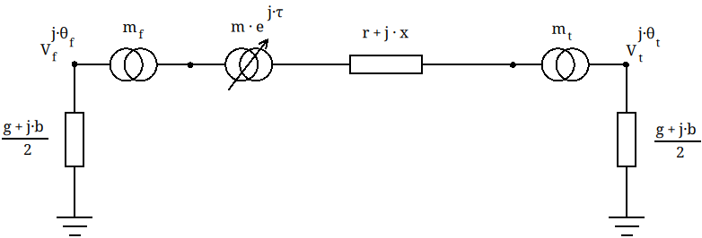
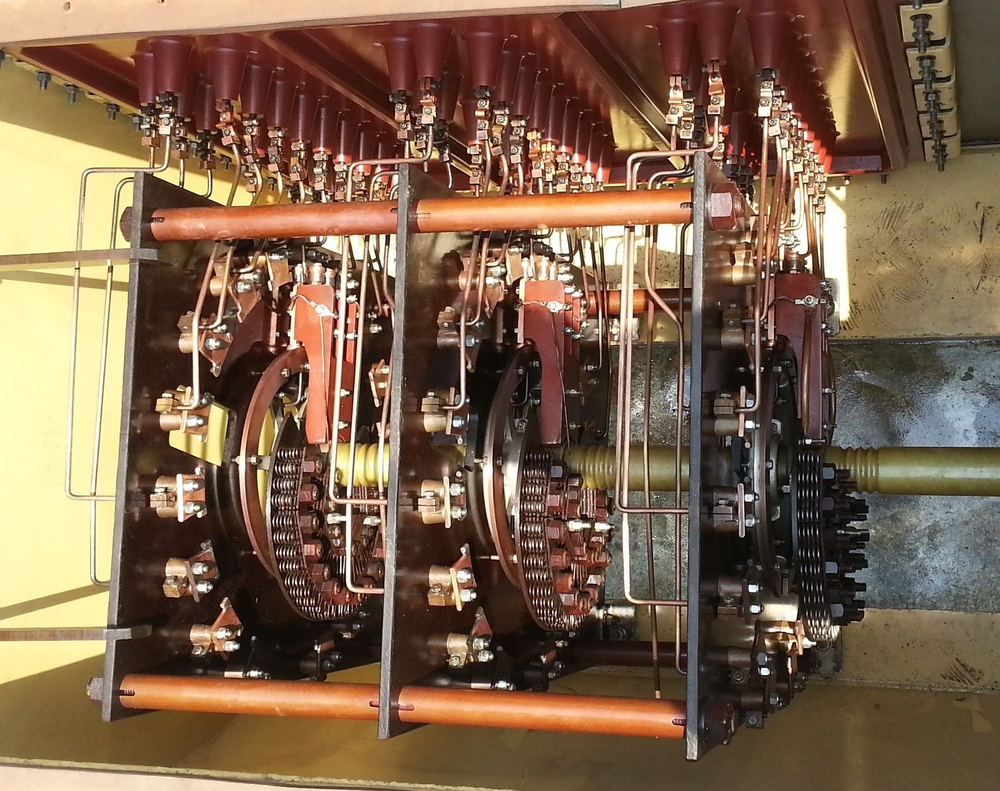

# The transformer


The power transformer is a device used to increase the voltage produced at a power station, and to lower the voltage again for safe consumption or cheaper distribution. At a high voltage, the current decrases to transport the same amount of power ($S = V \cdot I \cdot \sqrt{3}$), lowering the losses. But, equipement that can operate at higher voltages increase the price exponentially. The power transformer is a key device in power systems and in this lesson we'll learn how it is modelled and integrated in a power systems solver such as [GridCal](https://github.com/SanPen/GridCal).

The transformer also follows the $\pi$ model as the line, but with some extra aditions:



- r: Series resistance
- x: Series reactance
- g: shunt conductance
- b: Shunt susceptance
- $m_f$: Virtual tap at the from side $m_f = Vnom_{line} / Vnom_{bus\_from}$
- $m_t$: Virtual tap at the from side $m_t = Vnom_{line} / Vnom_{bus\_to}$
- $m$: Tap module
- $\tau$: Tap angle

**What is the tap?**



The tap changer is a device that allows to change the transformation ratio, not only in module ($m$) but depending on the tap changer constructive type, also in angle ($\tau$)

The virtual taps $m_f$ and $m_t$ are almost never discussed, but they are essential for the accurate per unit representation, as they only emerge in per unit calculations. They are meant to account for the impedance modification that is necessary to match the transformer nominal voltages and the buses nominal voltage in per-unit representations. It is very common, specially in istribution systems, to buy transfromers with a slightly higher voltage output compared to the connection point nominal voltage, to compensate for the voltage drop that occurs in distributions systems, without having to spend on a tap-changer capable transformer.


```python

```
