# Power Flow

## History
Power-flow analysis has evolved with available computing power and sparse
numerical methods:

- **1930s-1940s (pre-digital era):** Hand and desk-calculator methods were used
  for small transmission studies.
- **1956 (digital load flow):** Ward and Hale published one of the first
  digital-computer power-flow solutions for practical systems.
- **1960s (robust iterative methods):** Gauss-Seidel and Newton-style methods
  became standard; Van Ness and Griffin (1961) and Tinney and Hart (1967)
  established scalable formulations.
- **1970s (speed for operations):** Stott and Alsac (1974) introduced Fast
  Decoupled Load Flow, which became widely used in EMS/planning tools.
- **1990s-2010 (large-scale optimization era):** Sparse linear algebra,
  interior-point OPF, and high-quality open datasets/software (e.g., MATPOWER,
  PGLib-OPF) made very large AC studies routine.
- **2010s-today**: Holomorphic embedding. Trias et. al.

Representative references:
- Ward, J. B., and Hale, H. W. (1956), "Digital Computer Solution of Power-Flow Problems", *Transactions of the AIEE, Part III*.
- Van Ness, J. E., and Griffin, J. H. (1961), "Elimination methods for load-flow studies", *Transactions of the AIEE, Part III*.
- Tinney, W. F., and Hart, C. E. (1967), "Power Flow Solution by Newton's Method", *IEEE Transactions on Power Apparatus and Systems*.
- Stott, B., and Alsac, O. (1974), "Fast Decoupled Load Flow", *IEEE Transactions on Power Apparatus and Systems*.
- Zimmerman, R. D., Murillo-Sanchez, C. E., and Thomas, R. J. (2011), "MATPOWER: Steady-State Operations, Planning, and Analysis Tools for Power Systems Research and Education", *IEEE Transactions on Power Systems*.
- IEEE PES Task Force (2019), "PGLib Optimal Power Flow Benchmarks", *IEEE Transactions on Power Systems*.


## AC Power flow
AC power flow computes the steady-state operating point of an AC network:
bus voltage magnitudes $|V_i|$, bus voltage angles $\theta_i$, branch active/reactive
flows $(P_{ij},Q_{ij})$, and system losses, given network topology, equipment
parameters, and bus injections/controls.

It is the core feasibility model used before contingency analysis, OPF,
stability screening, and market studies. The exact model is nonlinear because
AC power depends on products of voltages and trigonometric angle terms.

### Non-linear formulation (the real thing)
The full AC power flow is a set of non-linear algebraic equations derived from
Kirchhoff's laws and complex power definitions.

Let bus voltages be:

$$
V_i = |V_i|e^{j\theta_i}
$$

and the network admittance matrix be:

$$
Y_{ij} = G_{ij} + jB_{ij}
$$

Injected complex power at bus $i$ is:

$$
S_i = P_i + jQ_i = V_i I_i^* = V_i\left(\sum_{j \in \mathcal{N}} Y_{ij}V_j\right)^*
$$

For clarity:

$$
S_i = V_i\left(\sum_{j \in \mathcal{N}} Y_{ij}V_j\right)^*
$$


We can expand the equation to only have real numbers:

$$
\begin{bmatrix}
 P \\
 Q
\end{bmatrix}
=
\begin{bmatrix}
B & G \\
G & B
\end{bmatrix}
\begin{bmatrix}
 \theta \\
 V_m
\end{bmatrix}
$$

The flows on the system branches can be computed as:

$$
	{S_f}_{k} = {{V_m}_f^2} \cdot {{Y_f}_{kf}^*} + {V_m}_f^{\angle{\theta_f}} \cdot {V_m}_t^{\angle{-\theta_t}}  \cdot  {Y_f}_{kt}^*
$$

$$
	{S_t}_{k} = {{V_m}_t^2} \cdot {{Y_t}_{kt}^*} + {V_m}_f^{\angle{-\theta_f}} \cdot {V_m}_t^{\angle{\theta_t}}  \cdot  {Y_t}_{kf}^*
$$

### Controls and solvability

The power flow simulation is an optimization problem 
formed by equality constraints. Because of this: 

- For every AC island we must specify one voltage module $Vm$ and one voltage angle $\theta$. 
Usually, at the so called *slack bus*.

In AC grids there are 4 magnitudes that enter into play ($V_m$, $\theta$, $P$ and $Q$ )

| Bus type  | Use | $V_m$ |  $\theta$ | $P$ | $Q$ |
-----------|-----|-------|-----------|-----|-----|
| $V\theta$ | (Slack) | Set   |  Set | Calc. | Calc. |
| $PQ$      | (No voltage control) | Calc. |  Calc. | Set | Set |
| $PV$      | (Local voltage control) | Set   |  Calc. | Set | Calc. |
| $P$       | (voltage controlling bus) | Calc. |  Calc. | Set | Calc. |
|  $PQV$    | (Remote voltage controlled) | Set   |  Calc. | Set | Set |

$V\theta$: Used for Slack nodes and external grids representation. This acts as the system necessary voltage reference.

$PQ$: Used for loads and external grids representation.

$PV$: Used for voltage-controlled generation.

$P$ + $PQV$: Used for remote voltage control made by generators and transformers.


### Linearization for Newton-Raphson like methods:

The linearization of any system of non linear equations looks like this:

$$
\begin{bmatrix}
\Delta f
\end{bmatrix}
=
\begin{bmatrix}
J
\end{bmatrix}
\begin{bmatrix}
\Delta x
\end{bmatrix}
$$

Adapting for the power flow problem:

$$
\begin{bmatrix}
P^{\text{spec}} - P(V,\theta) \\
Q^{\text{spec}} - Q(V,\theta)
\end{bmatrix}
=
\begin{bmatrix}
\partial P/\partial V_m & \partial P/\partial V_m \\
\partial Q/\partial \theta & \partial Q/\partial V_m
\end{bmatrix}
\begin{bmatrix}
\Delta \theta \\
\Delta |V|
\end{bmatrix}
$$

The Newton-Raphson algorithm consists in the following steps:

1. Pick an initial value for x (for instance: $V_m=1$ and $\theta=0$)
2. Compute $fx$.
3. converged = $max(abs(fx)) <= tolerance$
4. if converged -> end.

5. While not converged:
   6. Compute J
   7. Solve $\Delta x = J^{-1} \times fx$
   8. $x = x - \Delta x$
   9. Compute $fx$.
   10. converged = $max(abs(fx)) <= tolerance$
11. END

Example with VeraGrid:

```python
import os
import VeraGridEngine as vg

folder = os.path.join('data', 'pglib_opf')
fname = os.path.join(folder, 'IEEE39_1W.veragrid[pglib_opf_case14_ieee.matpower](data/pglib_opf/pglib_opf_case14_ieee.matpower)')
main_circuit = vg.open_file(fname)

options = vg.PowerFlowOptions(
    solver_type=vg.SolverType.NR,
    tolerance=1e-6,
    max_iter=20,
    retry_with_other_methods=False
)
results = vg.power_flow(main_circuit)

print(main_circuit.name)
print('Converged:', results.converged, 'error:', results.error)
print(results.get_bus_df())
print(results.get_branch_df())
```

### Linear formulation (the wildly popular method)
The most common linear approximation is the **DC power flow** (for AC active power):

Assumptions:
- Voltage magnitudes are close to 1 p.u.: $|V_i|\approx 1$.
- Angle differences are small: $\sin(\theta_i-\theta_j)\approx \theta_i-\theta_j$ and
  $\cos(\theta_i-\theta_j)\approx 1$.
- Line resistance is much smaller than reactance: $R_{ij}\ll X_{ij}$ (so losses are neglected).
- Shunts/tap effects are often ignored in the simplest form.

From the AC active-power equation, this yields on branch $(i,j)$:

$$
P_{ij} \approx \frac{\theta_i-\theta_j}{X_{ij}}
$$

and nodal balance:

$$
P_i = \sum_{j} \frac{\theta_i-\theta_j}{X_{ij}}
$$

Matrix form (after choosing a slack/reference bus):

$$
B' \, \theta = P
$$

where $B'$ is the reduced bus susceptance matrix.

How it is constructed in practice:
1. Build the network admittance model and keep only series susceptance terms
   $b_{ij}\approx -1/X_{ij}$ for connected buses.
2. Assemble $B$ with off-diagonals $B_{ij}=-1/X_{ij}$ and diagonals
   $B_{ii}=\sum_{j\neq i} 1/X_{ij}$.
3. Remove slack-bus row/column to get $B'$ and set $\theta_{\text{slack}}=0$.
4. Solve $B'\theta=P$ for unknown angles.
5. Recover line active flows with
   $P_{ij}=(\theta_i-\theta_j)/X_{ij}$.

This approximation is fast and very useful for screening, contingency ranking,
market/PTDF analysis, and initialization, but it does not model reactive power,
voltage magnitude variation, or losses accurately.

Example:

```python
import os
import VeraGridEngine as vg

folder = os.path.join('data', 'pglib_opf')
fname = os.path.join(folder, 'IEEE39_1W.veragrid[pglib_opf_case14_ieee.matpower](data/pglib_opf/pglib_opf_case14_ieee.matpower)')
main_circuit = vg.open_file(fname)

options = vg.PowerFlowOptions(
    solver_type=vg.SolverType.Linear,
    tolerance=1e-6,
    max_iter=20,
    retry_with_other_methods=False
)
results = vg.power_flow(main_circuit)

print(main_circuit.name)
print('Converged:', results.converged, 'error:', results.error)
print(results.get_bus_df())
print(results.get_branch_df())
```


## DC power flow

The DC power flow is exactly equal to the AC formulation but without "reactive" parts:


$$
P_i = V_i I_i = V_i\left(\sum_{j \in \mathcal{N}} G_{ij}V_j\right)
$$

For clarity:

$$
P_i = V_i\left(\sum_{j \in \mathcal{N}} G_{ij}V_j\right)
$$

### Solvability rules for AC-Linear power flow

The power flow simulation is an optimization problem 
formed by equality constraints. Because of this: 

- For every AC island we must specify one voltage angle $\theta$. 
Usually, at the so called *slack bus*.


## AC-DC Power flow

### Why AC-DC?


Today we have AC grids with some DC links. In the near future
the DC pieces of the grid will be increasinglymore relevant.

### Modelling AC-DC links (the easy way)

The easy way of modelling HVDC links is by using the 2-generator model.
In VeraGrid this is represented by the `HvdcLine`device.


This is a well known model in the literature, however you cannot represent a
proper DC grid with it, nor you can simulate contingencies on the DC elements 
or have more than one cable at a time.


### Modelling AC-DC links (the easy way)

The easy way of modelling HVDC links is by using the 2-generator model.
In VeraGrid this is represented by the `HvdcLine`device.


This is a well known model in the literature, however you cannot represent a
proper DC grid with it, nor you can simulate contingencies on the DC elements 
or have more than one cable at a time.


#### Controls available

The `HvdcLine` device has only 2 controls: Active power control (`Pset`) and AC line emulation (`free`)

| Control type | Effect                                                      |
|--------------|-------------------------------------------------------------|
| Pset         | Set active power                                            |
| free         | AC emulation:<br/>$P = P_0 + k \cdot (\theta_f - \theta_t)$ |

Let's see a python example using 4 buses:

```python
import VeraGridEngine as vg

# Grid instantiation
grid = vg.MultiCircuit()

# Define buses
bus1 = grid.add_bus(vg.Bus(name='B1', Vnom=135, is_slack=True))
bus2 = grid.add_bus(vg.Bus(name='B2', Vnom=135))
bus5 = grid.add_bus(vg.Bus(name='B5', Vnom=135))
bus6 = grid.add_bus(vg.Bus(name='B6', Vnom=135))

# Define AC lines
line12 = grid.add_line(vg.Line(name='L12', bus_from=bus1, bus_to=bus2, r=0.001, x=0.01))
line25 = grid.add_line(vg.Line(name='L25', bus_from=bus2, bus_to=bus5, r=0.05, x=0.05))
line56 = grid.add_line(vg.Line(name='L56', bus_from=bus5, bus_to=bus6, r=0.001, x=0.01))
line256 = grid.add_line(vg.Line(name='L562', bus_from=bus5, bus_to=bus6, r=0.001, x=0.01))

# Define Hvdc Line
line34 = grid.add_hvdc(vg.HvdcLine(name='L34', bus_from=bus2, bus_to=bus5, Pset=0.2))

# Define generators
grid.add_generator(bus=bus1, api_obj=vg.Generator(name='Gen1', P=1.0, vset=1.01))
grid.add_generator(bus=bus6, api_obj=vg.Generator(name='Gen2', P=1.0, vset=1.02))

# Define loads
grid.add_load(bus=bus2, api_obj=vg.Load(name='Load1', P=3.0, Q=0.3))
grid.add_load(bus=bus5, api_obj=vg.Load(name='Load2', P=2.0, Q=0.5))

# Run power flow
pf_options = vg.PowerFlowOptions(solver_type=vg.SolverType.PowellDogLeg,
                                 retry_with_other_methods=False)
pf_driver = vg.PowerFlowDriver(grid=grid, options=pf_options)
pf_driver.run()

print('Bus values')
print(pf_driver.results.get_bus_df())

print('Branch values')
print(pf_driver.results.get_branch_df())

print("error:", pf_driver.results.error)

vg.save_file(grid, "6bus_a.veragrid")
```

### Modelling AC-DC links (the better way)

A better way of simulating AC-DC grids is what led us to research the literature
for formulations that were complete, correct and explicit. Founding none, we
started to create a formulation, by means of introducing how a converter device should behave. 

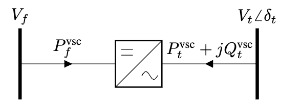

It turns out that a converter cannot be a regular $\pi$-branch. 
It has to be a _decoupled_ branch represented by two injections.
More or less like the 2-generators model: 2 injections plus a coupling equation.

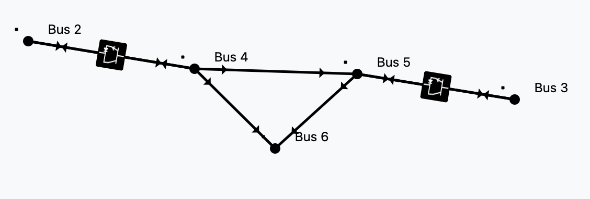

By introducing this type of branch, we get the freedom to represent the 
AC and DC grids in any level of detail.


#### Solvability rules for ACDC power flow

The power flow simulation is an optimization problem 
formed by equality constraints. Because of this: 

- For every AC island we must specify one voltage module $Vm$ and one voltage angle $\theta$. 
Usually, at the so called *slack bus*.

- For every DC island there must be a $Vm$ set point. 
This can be thought of as a DC slack.

- An AC branch has 4 unknowns ($Vm_f, Vm_t, \theta_f, \theta_t$) 
and 4 equations ($P_f, P_t, Q_f, Q_t$).

- A DC branch has 2 unknowns ($Vm_f, Vm_t$) and 2 equations 
($P_f, P_t$).

- A converter branch has 3 unknowns ($Vm_f, Vm_t, \theta_t$) 
and only 1 _natural_ equation, the losses equation.
That is why every converter must control two magnitudes to 
add the 2 extra equations needed. 


Since we must ensure equal number of unknowns and equations globally, 
there is a control compatibility theory.

#### Controls available

Steaming from the solvability rules, we can introduce the converter controls.
For every converter we need to choose 2 controls to ensure solvability.

| Control type  | Effect                                             |
|---------------|----------------------------------------------------|
| $Vm_{dc}$     | Voltage module control at the DC side (from side)  |
| $Vm_{ac}$     | Voltage module control at the AC side (to side)    |
| $\theta_{ac}$ | Voltage angle control at the AC side (to side)     |
| $P_{ac}$      | Active power control at the AC side (to side)      |
| $Q_{ac}$      | Reactive power control at the AC side (to side)    |
| $P_{dc}$      | Active power control at the DC side (from side)    |


### Putting it all together

We wanted a no-compromise AC-DC power flow with good convergence properties.

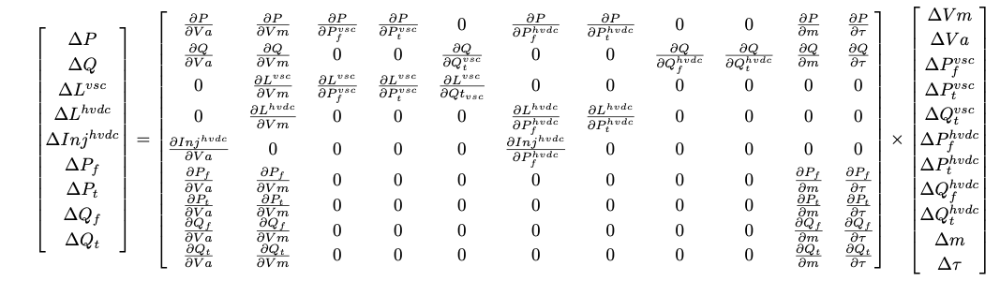

This method was introduced in [here](https://upcommons.upc.edu/server/api/core/bitstreams/c522ad67-438a-48c3-aa1b-a03859cd6659/content)
and further developed in VeraGrid from 2024 to 2025.

#### 6-bus example

```python
import VeraGridEngine as vg

# Grid instantiation
grid = vg.MultiCircuit()

# Define buses
bus1 = grid.add_bus(vg.Bus(name='B1', Vnom=135, is_slack=True))
bus2 = grid.add_bus(vg.Bus(name='B2', Vnom=135))
bus3 = grid.add_bus(vg.Bus(name='B3', Vnom=100, is_dc=True))
bus4 = grid.add_bus(vg.Bus(name='B4', Vnom=100, is_dc=True))
bus5 = grid.add_bus(vg.Bus(name='B5', Vnom=135))
bus6 = grid.add_bus(vg.Bus(name='B6', Vnom=135))

# Define AC lines
line12 = grid.add_line(vg.Line(name='L12', bus_from=bus1, bus_to=bus2, r=0.001, x=0.1))
line25 = grid.add_line(vg.Line(name='L25', bus_from=bus2, bus_to=bus5, r=1.05, x=0.5))
line56 = grid.add_line(vg.Line(name='L56', bus_from=bus5, bus_to=bus6, r=0.001, x=0.1))
line256 = grid.add_line(vg.Line(name='L562', bus_from=bus5, bus_to=bus6, r=0.001, x=0.1))

# Define DC lines
line34 = grid.add_dc_line(vg.DcLine(name='L34', bus_from=bus3, bus_to=bus4, r=2.05))

# Define VSCs
vsc1 = grid.add_vsc(vg.VSC(name='VSC1', bus_from=bus3, bus_to=bus2, 
                           rate=100, alpha1=0.001, alpha2=0.015, alpha3=0.01,
                           control1=vg.ConverterControlType.Vm_ac, 
                           control2=vg.ConverterControlType.Pdc,
                           control1_val=1.0333, 
                           control2_val=0.2))

vsc2 = grid.add_vsc(vg.VSC(name='VSC2', bus_from=bus4, bus_to=bus5, 
                           rate=100, alpha1=0.001, alpha2=0.015, alpha3=0.01,
                           control1=vg.ConverterControlType.Vm_dc, 
                           control2=vg.ConverterControlType.Qac,
                           control1_val=1.05, 
                           control2_val=-7.21))

# Define generators
grid.add_generator(bus=bus1, api_obj=vg.Generator(name='Gen1', P=1.0, vset=1.01))
grid.add_generator(bus=bus6, api_obj=vg.Generator(name='Gen2', P=1.0, vset=1.02))

# Define loads
grid.add_load(bus=bus2, api_obj=vg.Load(name='Load1', P=3.0, Q=0.3))
grid.add_load(bus=bus5, api_obj=vg.Load(name='Load2', P=2.0, Q=0.5))

# Run power flow
pf_options = vg.PowerFlowOptions(solver_type=vg.SolverType.PowellDogLeg,
                                 retry_with_other_methods=False)
pf_driver = vg.PowerFlowDriver(grid=grid, options=pf_options)
pf_driver.run()

print('Bus values')
print(pf_driver.results.get_bus_df())

print('Branch values')
print(pf_driver.results.get_branch_df())

print("error:", pf_driver.results.error)
```


|    |      Vm |        Va |         P |              Q |
|----|---------|-----------|-----------|----------------|
| B1 | 1.01    |  0        | 15.5919   | -236.815       |
| B2 | 1.0333  | -0.215613 | -3        |   -0.299984    |
| B3 | 1.04608 |  0        | -0.197999 |   -9.75607e-22 |
| B4 | 1.05    |  0        |  0.198741 |    9.79262e-22 |
| B5 | 1.02144 |  0.362496 | -2        |   -0.499983    |
| B6 | 1.02    |  0.373325 |  1        |  -29.3828      |


|      |        Pf |             Qf |         Pt |            Qt |   loading |       Ploss |       Qloss |
|------|-----------|----------------|------------|---------------|-----------|-------------|-------------|
| L12  | 15.5919   | -236.815       | -15.0397   | 242.337       | 1559.19   | 0.552148    | 5.52148     |
| L25  |  1.66417  |   22.9626      |  -1.41595  | -22.7143      |  166.417  | 0.248218    | 0.248218    |
| L56  | -0.497924 |   14.7122      |   0.500001 | -14.6914      |  -49.7924 | 0.00207697  | 0.0207697   |
| L562 | -0.497924 |   14.7122      |   0.500001 | -14.6914      |  -49.7924 | 0.00207697  | 0.0207697   |
| L34  | -0.199999 |   -9.75607e-22 |   0.200749 |   9.79262e-22 |  -19.9999 | 0.000749344 | 3.65533e-24 |


#### 3120 AC bus + 5 DC bus case

This is the 3120 bus case from the pglib / Matpower case library. 
It has been modified to embed a 5 DC bus network within it.

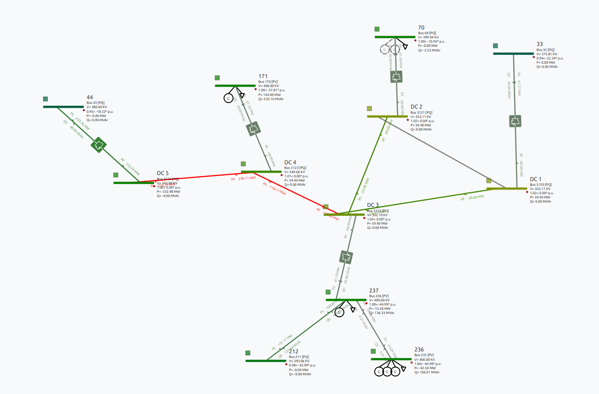

This is the AC-DC subgrid schematic.

Just load the case from [`data/case3120_5_he.veragrid`](data/case3120_5_he.veragrid) 
into the GUI by drag&drop. The excersise is to:

1. Run a power flow
2. Interpret the power flow results
3. Change the converter controls and control set points and see the effects

##### 1. Power Flow

- Click the **Power Flow** icon to start the calculation:  
   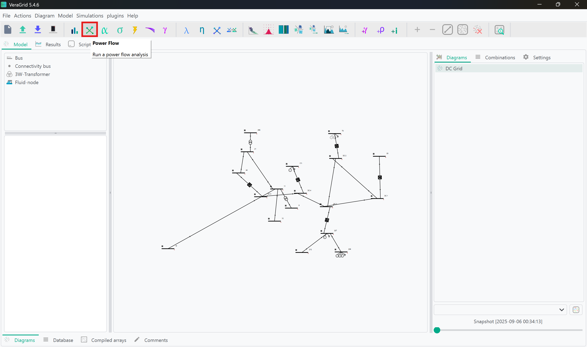
- Once completed, the results can be inspected in two ways:
   - **Directly on the schematic**:  
     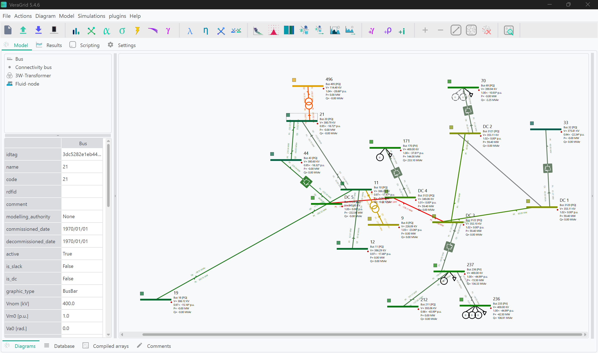
   - **Through the Results tab**, which provides logs and numerical details:  
     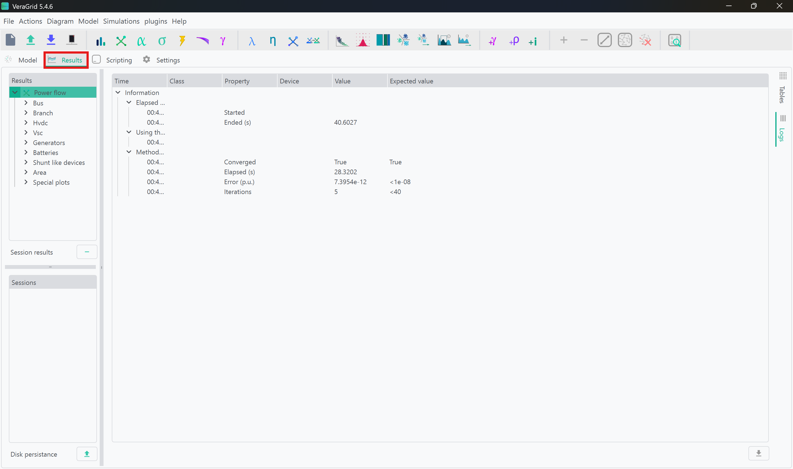

👉 Tip: For a structured overview, click on **Tables** and expand the cascading menu. This gives access to all device data in the grid:  
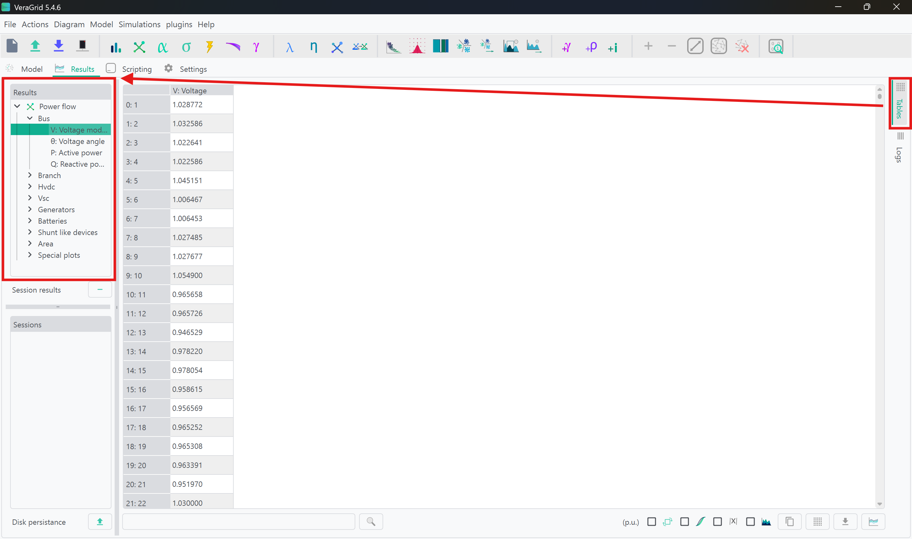

---

##### 2. Interpreting Results

- Bus Voltages: Check voltage levels and angle across the grid.
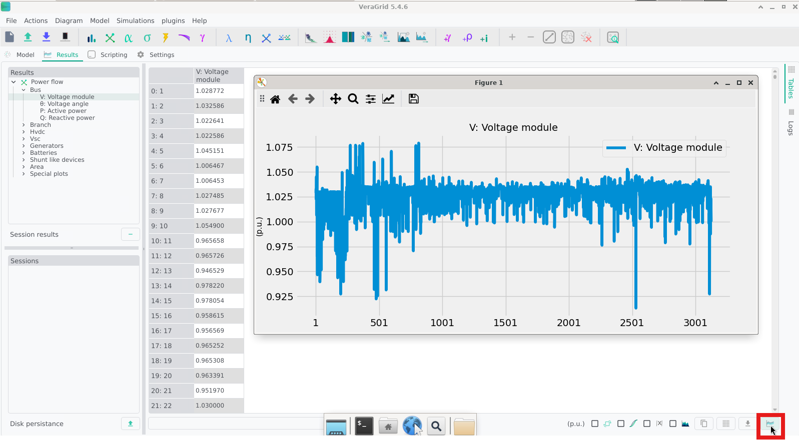
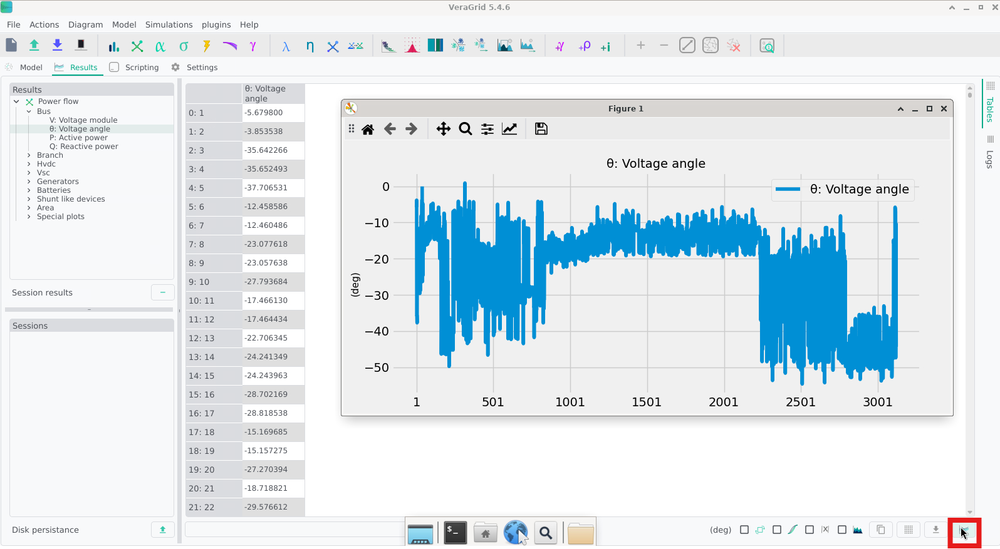
- AC-DC Branch Flows: Analyze power flows through AC and DC branches
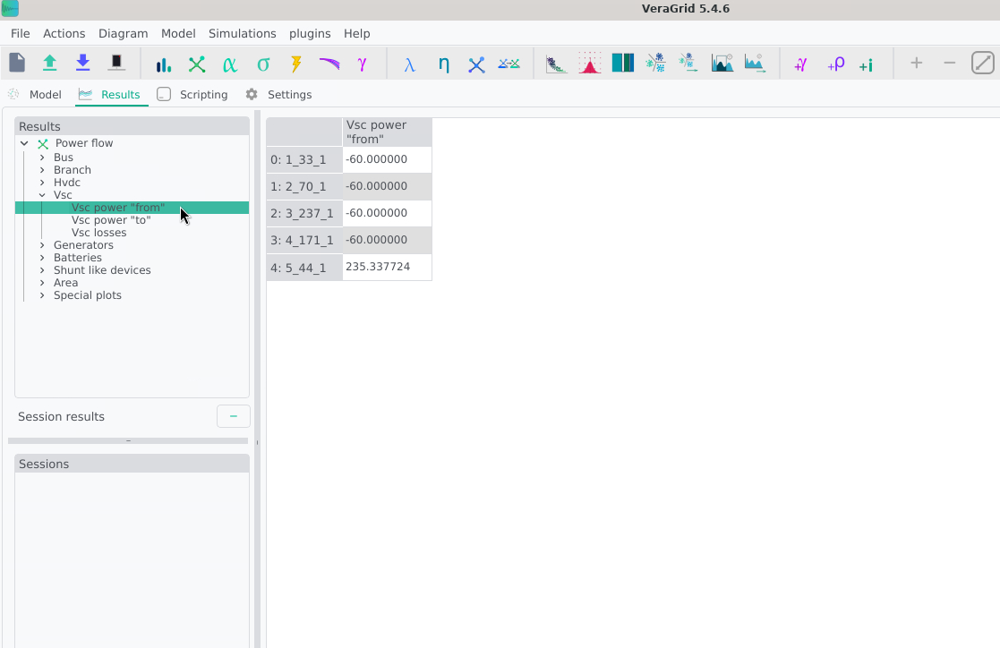
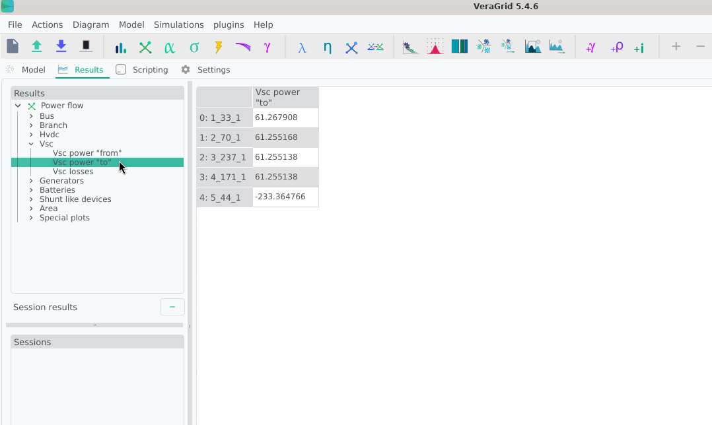
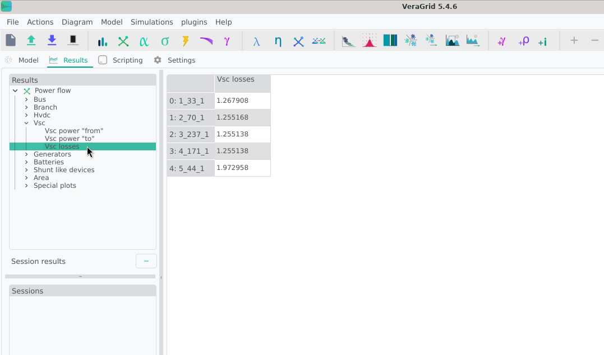
- Once again, we may return to the schematic view for a more intuitive understanding of the results to observe the bus magnitudes and branch flows.


Notice how all except one of the converters are operating at fixed power. The last one is controlling the DC voltage, as is required for solvability. Let's try changing some controls:

##### 3. Changing Converter Controls
- In the schematic, click on a converter to open its properties. Here, we focus on VSC interfacing between the DC Bus 2 and AC Bus 70
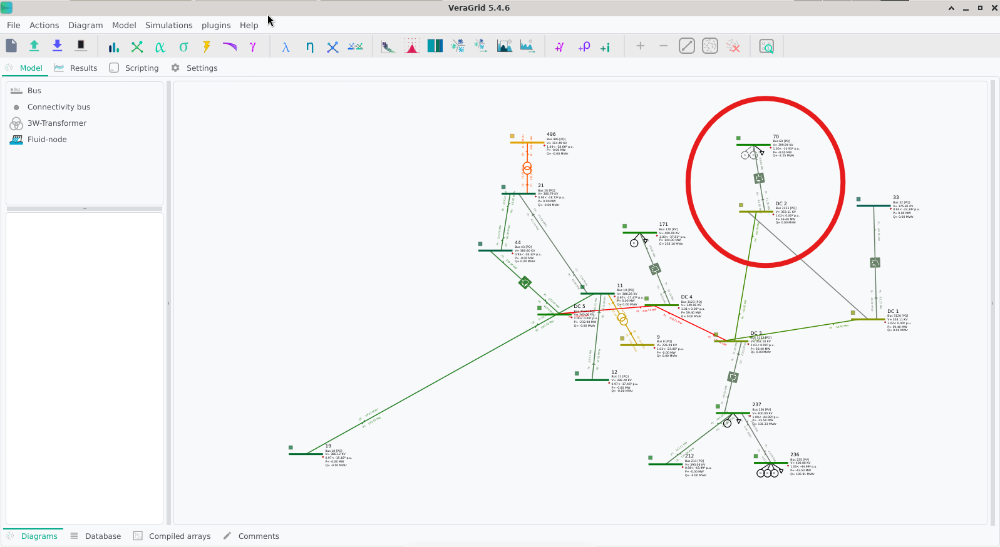
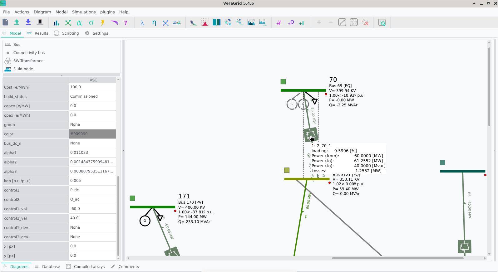
- We can begin with a simple change of direction of the active power flow. Change the `control1` dropdown menu from `Pdc` to `Pac`. Leave the rest as is and click on the Power Flow icon again to re-run the simulation.
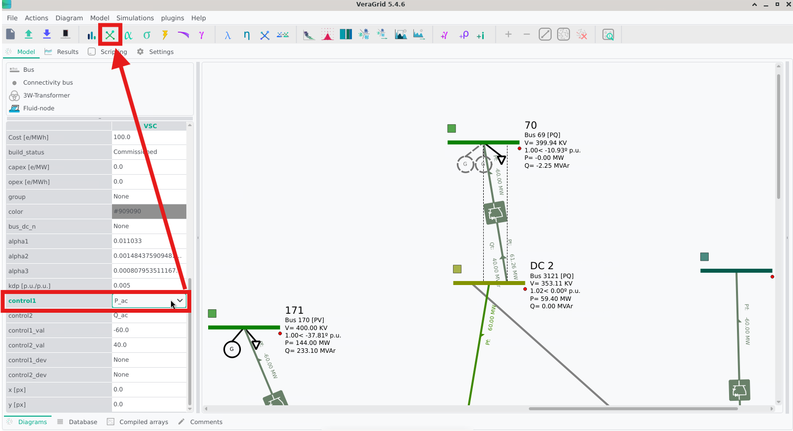
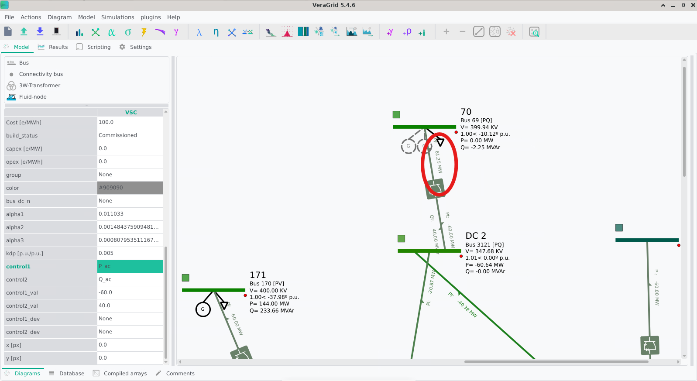
- Notice how the power flow direction has changed, and the DC voltage has adjusted accordingly. If we prefer, we can explicitly set the DC voltage instead of letting it float. Change `control1` to `Vm_dc` and set `control1_val` to `1.01`. Run the power flow again.
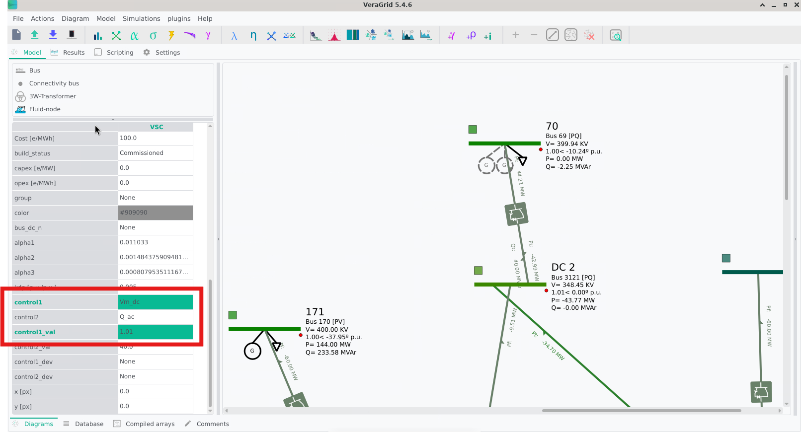
