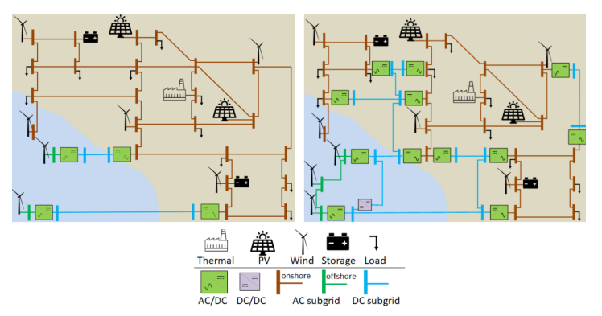
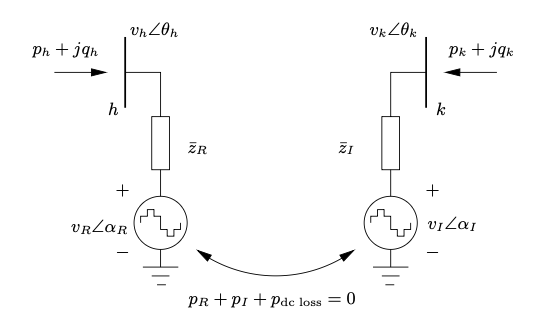
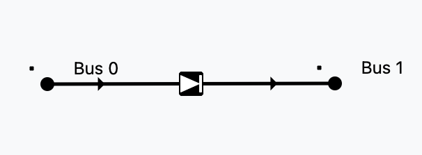

# Power Flow

## History
Power-flow analysis has evolved with available computing power and sparse
numerical methods:

- **1930s-1940s (pre-digital era):** Hand and desk-calculator methods were used
  for small transmission studies.
- **1956 (digital load flow):** Ward and Hale published one of the first
  digital-computer power-flow solutions for practical systems.
- **1960s (robust iterative methods):** Gauss-Seidel and Newton-style methods
  became standard; Van Ness and Griffin (1961) and Tinney and Hart (1967)
  established scalable formulations.
- **1970s (speed for operations):** Stott and Alsac (1974) introduced Fast
  Decoupled Load Flow, which became widely used in EMS/planning tools.
- **1990s-today (large-scale optimization era):** Sparse linear algebra,
  interior-point OPF, and high-quality open datasets/software (e.g., MATPOWER,
  PGLib-OPF) made very large AC studies routine.

Representative references:
- Ward, J. B., and Hale, H. W. (1956), "Digital Computer Solution of Power-Flow Problems", *Transactions of the AIEE, Part III*.
- Van Ness, J. E., and Griffin, J. H. (1961), "Elimination methods for load-flow studies", *Transactions of the AIEE, Part III*.
- Tinney, W. F., and Hart, C. E. (1967), "Power Flow Solution by Newton's Method", *IEEE Transactions on Power Apparatus and Systems*.
- Stott, B., and Alsac, O. (1974), "Fast Decoupled Load Flow", *IEEE Transactions on Power Apparatus and Systems*.
- Zimmerman, R. D., Murillo-Sanchez, C. E., and Thomas, R. J. (2011), "MATPOWER: Steady-State Operations, Planning, and Analysis Tools for Power Systems Research and Education", *IEEE Transactions on Power Systems*.
- IEEE PES Task Force (2019), "PGLib Optimal Power Flow Benchmarks", *IEEE Transactions on Power Systems*.

## AC Power flow
AC power flow computes the steady-state operating point of an AC network:
bus voltage magnitudes $|V_i|$, bus voltage angles $\theta_i$, branch active/reactive
flows $(P_{ij},Q_{ij})$, and system losses, given network topology, equipment
parameters, and bus injections/controls.

It is the core feasibility model used before contingency analysis, OPF,
stability screening, and market studies. The exact model is nonlinear because
AC power depends on products of voltages and trigonometric angle terms.

### Non-linear formulation (the real thing)
The full AC power flow is a set of non-linear algebraic equations derived from
Kirchhoff's laws and complex power definitions.

Let bus voltages be:

$$
V_i = |V_i|e^{j\theta_i}
$$

and the network admittance matrix be:

$$
Y_{ij} = G_{ij} + jB_{ij}
$$

Injected complex power at bus $i$ is:

$$
S_i = P_i + jQ_i = V_i I_i^* = V_i\left(\sum_{j \in \mathcal{N}} Y_{ij}V_j\right)^*
$$

For clarity:

$$
S_i = V_i\left(\sum_{j \in \mathcal{N}} Y_{ij}V_j\right)^*
$$

Unknowns are usually solved by bus type:
- Slack bus: $|V|,\theta$ fixed, $P,Q$ result from the solution.
- PV bus: $P,|V|$ fixed, unknown $\theta,Q$ (with $Q$-limits handled via PV/PQ switching).
- PQ bus: $P,Q$ fixed, unknown $|V|,\theta$.

Compact mismatch form used in Newton-Raphson:

$$
\Delta x = \begin{bmatrix}
\Delta \theta_{\text{(non-slack)}} \\
\Delta |V|_{\text{(PQ)}}
\end{bmatrix},
\quad
\begin{bmatrix}
\Delta P \\
\Delta Q
\end{bmatrix}
=
\begin{bmatrix}
P^{\text{spec}} - P(V,\theta) \\
Q^{\text{spec}} - Q(V,\theta)
\end{bmatrix}
$$

$$
\begin{bmatrix}
\Delta P \\
\Delta Q
\end{bmatrix}
=
\begin{bmatrix}
J_{11} & J_{12} \\
J_{21} & J_{22}
\end{bmatrix}
\begin{bmatrix}
\Delta \theta \\
\Delta |V|
\end{bmatrix}
$$

with Jacobian blocks $J_{11}=\partial P/\partial \theta$,
$J_{12}=\partial P/\partial |V|$,
$J_{21}=\partial Q/\partial \theta$,
$J_{22}=\partial Q/\partial |V|$.

Historical references:
- Ward, J. B., and Hale, H. W. (1956), "Digital Computer Solution of Power-Flow Problems", *Transactions of the AIEE, Part III*.
- Van Ness, J. E., and Griffin, J. H. (1961), "Elimination methods for load-flow studies", *Transactions of the AIEE, Part III*.
- Tinney, W. F., and Hart, C. E. (1967), "Power Flow Solution by Newton's Method", *IEEE Transactions on Power Apparatus and Systems*.
- Stott, B., and Alsac, O. (1974), "Fast Decoupled Load Flow", *IEEE Transactions on Power Apparatus and Systems*.

### Linear formulation (the wildly popular method)
The most common linear approximation is the **DC power flow** (for AC active power):

Assumptions:
- Voltage magnitudes are close to 1 p.u.: $|V_i|\approx 1$.
- Angle differences are small: $\sin(\theta_i-\theta_j)\approx \theta_i-\theta_j$ and
  $\cos(\theta_i-\theta_j)\approx 1$.
- Line resistance is much smaller than reactance: $R_{ij}\ll X_{ij}$ (so losses are neglected).
- Shunts/tap effects are often ignored in the simplest form.

From the AC active-power equation, this yields on branch $(i,j)$:

$$
P_{ij} \approx \frac{\theta_i-\theta_j}{X_{ij}}
$$

and nodal balance:

$$
P_i = \sum_{j} \frac{\theta_i-\theta_j}{X_{ij}}
$$

Matrix form (after choosing a slack/reference bus):

$$
B' \, \theta = P
$$

where $B'$ is the reduced bus susceptance matrix.

How it is constructed in practice:
1. Build the network admittance model and keep only series susceptance terms
   $b_{ij}\approx -1/X_{ij}$ for connected buses.
2. Assemble $B$ with off-diagonals $B_{ij}=-1/X_{ij}$ and diagonals
   $B_{ii}=\sum_{j\neq i} 1/X_{ij}$.
3. Remove slack-bus row/column to get $B'$ and set $\theta_{\text{slack}}=0$.
4. Solve $B'\theta=P$ for unknown angles.
5. Recover line active flows with
   $P_{ij}=(\theta_i-\theta_j)/X_{ij}$.

This approximation is fast and very useful for screening, contingency ranking,
market/PTDF analysis, and initialization, but it does not model reactive power,
voltage magnitude variation, or losses accurately.

## DC power flow

## AC-DC Power flow

### Why AC-DC?

Today we have AC grids with some DC links. In the near future
the DC pieces of the grid will be increasinglymore relevant.

### Modelling AC-DC links (the easy way)

The easy way of modelling HVDC links is by using the 2-generator model.
In VeraGrid this is represented by the `HvdcLine`device.

This is a well known model in the literature, however you cannot represent a
proper DC grid with it, nor you can simulate contingencies on the DC elements 
or have more than one cable at a time.

